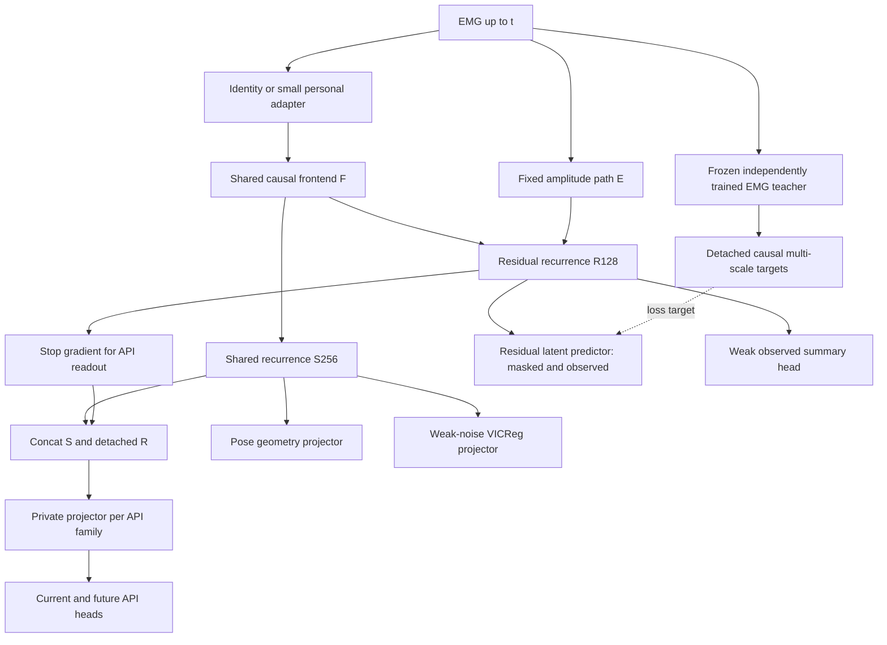

# HumanEngine：多 API 监督与残差目标的聚焦理论审查

日期：2026-09-19。状态：**PROPOSED；仅理论设计，未实施、未训练、未经效果验证。**

本文是 `HUMANENGINE_EMG_V0_1_ARCHITECTURE.md` 的增补，不覆盖原稿。只修改两个问题涉及的目标、读出权限和训练组织；通道数、采样频率、环境配置暂缓。原稿是比较基线；若采纳本增补，下文的明确变更优先于原稿对应条款。文献支持学习原则，不等于支持 HumanEngine 的效果声明。

**推荐一：按 API 家族组织预算与采样，以固定尺度的家族损失、CAGrad 型方向协调、旧 API 回放构成多监督框架。** pose 的 current、future、geometry 共享一份家族预算；所有显式 API 平等读取 `[S, stopgrad(R)]`，拥有各自投影与输出头。新增 API 改变家族集合及其预算，不靠训练时间衰减 pose。

**推荐二：把 residual 的主要目标改为独立 EMG 自监督老师的、多尺度因果潜在特征；保留弱 observed-latent 和物理摘要锚。** 老师先用独立参数和无 API 标签的目标训练，经健康检查后冻结。它不与 HE 共享前端、EMA 或优化器。这个方案具有更宽的目标覆盖潜力，**尚不能宣称优于原来的 RMS/band 主目标**。

两项推荐的共同边界：有限表示不能保证保留所有未知任务；任务冲突不能靠一个优化器消除；独立老师不等于生理真值；分支分开不等于统计独立。

## 1. 判断依据与文献评估：多 API 监督

### 1.1 先决定什么应平等，再选择优化器

需要区分五层问题：科学上认可哪些 API、各 API 的任务重要性、数据暴露频率、梯度竞争、顺序学习的遗忘。GradNorm/FAMO/PCGrad/CAGrad 都不能独自解决这五层问题。尤其不能把数据集数量、标注量或高采样率当成人体变量的重要性。

以 pose、force、contact 三个家族为例：五个 pose 数据集仍然只占一个 pose 家族；当前与未来姿态是族内任务，不能各得一张与 force 等重的票。force 的五个输出分量也不能各得一票。家族边界必须在 manifest 中登记，不能为提高影响力而拆名。

“各族等预算”是透明的研究默认值，不是科学公平定理。后续若有真实产品优先级或标签可信度差异，可以登记不同基础预算；不得让动态优化器偷偷替研究者定义重要性。

### 1.2 候选方法与本任务取舍

| 方法 / 核心原则 | 对 HE 的价值 | 主要风险、复杂度 | 判决 |
|---|---|---|---|
| 固定族预算 + 分层采样 | 最直接解决五份 pose 对一份 force、缺标签与重复曝光问题 | 不自动解决负迁移；低复杂度 | **必需基础，也是主对照** |
| GradNorm [Q1-1]：按相对学习速度调节加权梯度范数 | 能识别尺度与训练速度失衡 | 卡住/噪声任务可能持续增重；新头未成熟也会被误认为学习慢；中复杂度 | 不作首选；仅在明确速率失衡时对照 |
| FAMO [Q1-2]：用 log-loss 的相对进展调权，减少逐任务梯度存储 | API 数量大时有资源优势 | 缺失任务、数据批变化、loss 下界与接近零值影响进展估计；总数据前向成本并非 O(1) | **K 很大时的替代方案**，不与 CAGrad 叠加 |
| PCGrad [Q1-3]：投影掉冲突方向分量 | 易实现、局部冲突诊断清楚 | 不定义预算/采样；投影顺序影响结果；不能保证每任务改善 | 简单梯度手术对照，非默认 |
| CAGrad [Q1-4]：在平均方向附近改善最差局部方向收益 | 小 K 时每族梯度可审查，显式限制偏离基础目标 | 需要逐族梯度、小规模求解器；最差任务会受噪声影响；不保证 Pareto 改善 | **推荐的方向协调器，采用下文明确扩展** |
| Homoscedastic uncertainty weighting [Q1-5] | 有合理 likelihood 时可处理回归尺度/噪声 | 不确定性不是 API 重要性；可能折价稀缺而重要的 force；中复杂度 | 可用于族内有依据的概率建模，不分配族间票数 |
| Nash-MTL [Q1-6]：梯度 bargaining | 更直接讨论任务之间的交易，理论上值得比较 | 每族梯度、求解与适用假设增加负担；不解决标注域混杂 | 有竞争力的后续替代，不凭名称认定更强 |
| 部分标注任务关系学习 [Q1-7] | 重叠标签可学习有证据的任务关系 | pose→force/contact 常不可识别；关系损失可能制造伪真值 | 保留 masks/多头原则，不默认跨 API 伪标注 |
| Replay + output distillation [Q1-8,9] | 给旧域提供实际约束，便于版本化接口 | 回放覆盖、存储成本、旧输出误差固化 | **从 v0.1 准备契约；第二 API 到来时启用** |

FAMO 特别容易被写错：`z=softmax(xi)` 不是最终 loss 系数；有效系数还与 `(L_i-L_i,min+epsilon)^(-1)` 成比例。其更新依赖更新前后 log-loss 差；异构数据要在相同家族、相同样本及相同随机视图上比较，不能拿下一批更容易的数据充当学习进展。论文的梯度聚合效率不等于 K 个数据源、head 和前向免费。增加裁剪、下界或缺失更新规则后，必须标为修改版，不能照搬原收敛声明。

### 1.3 多 API 不自动产生统一生理语义

若 pose 只在设备 A/用户群 A 标注、force 只在设备 B/用户群 B 标注，任务身份与测量域混杂。模型可先识别域，再走隐含专用功能；多任务训练成功不能证明共享生理表示成立。优化器无法补足这种不可识别性。应优先取得少量交叉域、交叉 API 标签或匹配条件的桥接样本，而非生成 pose→force 伪真值。

## 2. 推荐的动态监督机制：可执行的数学契约

### 2.1 家族、数据和缺失标签

记当前获准训练的 API 家族集合为 `A`，`K=|A|`。没有真实标签、没有可信旧域回放的未来 API 不进入集合，不建空头来凑“多任务”。

一次 macrostep 先采家族，再采家族内数据源，最后采用户/会话/片段；所有 microbatch 的梯度在同一参数快照累计，最后只更新一次共享 core。每个活跃家族取得固定数量的有效目标锚点；大数据集不能多走若干 optimizer steps。序列和长时间相邻帧的独立性另计，不用插值标签虚增信息量。

数据源预算按稳定的 acquisition/source ID 分配。复制、拆分或重命名同一个语料不能改变它的总抽样质量；内容重复还需按 recording/window ID 去重。真正新增独立 pose 语料可改善 pose 的内部覆盖，但不增加家族票数。一个样本有多个标签时可以共享前向计算，仍分别计入各家族额度，不能顺便增加未计划的其他家族曝光。

对族 `i` 的分量 `j`：

```text
ell_ij = sum(valid_ij * point_loss_ij) / sum(valid_ij)
L_i    = sum_j beta_ij * ell_ij / a_ij / sum_j beta_ij
```

`valid` 包含该标签有效性、时间支持与 finite 条件；缺失为 NA，不是 0。窗口无有效标签不计作该分量样本。macrostep 尽量补齐登记分量的额度；暂时无数据就记录 skipped exposure，不悄悄把分母和预算重新分给 pose。长期无法取样则建立新训练阶段 manifest，明确活跃集合变更。

`a_ij>0` 是训练前冻结的尺度，不是每步 loss 或梯度范数：回归先按 train-only 物理/统计尺度标准化，使用训练集常量预测器的误差作为参考；分类可用训练 prevalence 常量预测器的 CE；不适用常量参照的几何/正则项使用明确的单位尺度 1。近零参考损失须用登记的 floor 或将退化任务标为不适用；不能除以接近零的数来放大任务。尺度、beta、有效项定义和回放配比全部版本化。

当前 pose 家族的默认分量为 `(current, future, geometry)`，`beta=(1,.5,.05)`；未来 horizon 先在 future 分量内平均。geometry 仍只作用于自己的 S 投影；它是同一标签的归纳偏置，没有独立预算。其他家族不必复制 pose geometry，也不能因为没有它就少一份族预算。

### 2.2 基础预算与表示保留预算

除了显式 API，保留一个表示目标族 `reserve`：

```text
L_reserve = (L_R / a_R + 0.1 * L_VICReg / a_V) / 1.1
alpha_i   = 0.8 / K       for explicit API families
alpha_r   = 0.2          for reserve
L_base    = sum_i alpha_i * L_i + alpha_r * L_reserve
```

`L_R` 见第 4 节。`a_R` 使用冻结 teacher 的零均值输出预测器参照尺度，`a_V=1`；族内子项在各自归一化后再合并。0.8/0.2、0.1 等是可复现的首轮研究设置，不是信息论常量。它们替代原稿 1/.5/.2/.1/.05 在跨家族层面的直接求和。

新增 force 后 pose 的基础预算由 0.8 变成 0.4；再加 contact 后成为 0.8/3。这是家族集合改变的结果，无 pose 时间衰减 schedule。**这些是基础目标预算，既不是最终梯度范数份额，也不是每个 API 的性能保护下限。**

### 2.3 CAGrad 型协调：使用一个共享 core 向量

令可训练通用 core 参数 `theta_c=(F,S,R)`；个体 A/U 此时 identity 且冻结。每个家族按第 5 节路由求 `g_i`，在它不更新的参数块填零，排除私有 head/projector 的参数。只在整个 core 向量上解一次，**不在 F/S/R 各解一个含不同任务集合的 solver**。分块 norm/cosine 仅作诊断。

```text
g0 = sum_i alpha_i * g_i + alpha_r * g_r
d* = argmax_d min_j <g_j,d>
     subject to ||d-g0||_2 <= c ||g0||_2
theta_c <- theta_c - eta*d*
```

`j` 遍历有效 API 家族和 reserve；各 `g_j` 已由固定尺度损失产生，不再单位范数化。首轮 `c=0` 当 K=1；K≥2 才用 `c=.25`。这使单 API 阶段不为尚不存在的 API 冲突付出控制器复杂度。若某家族没有有效梯度则记 NA 并修复采样；真正已收敛的零梯度不是缺失标签，仍可使最差改进为零。

这是 **weighted-base CAGrad 扩展**，不是原论文等权平均的逐字复现。其小问题可用 simplex 上的对偶：最小化 `<g_w,g0> + r*||g_w||`，其中 `g_w=sum_j w_j g_j`、`w>=0,sum(w)=1,r=c||g0||`；非退化时 `d=g0+r*g_w/||g_w||`。零范数/多解情形不得直接除 epsilon 假造解，须满足原始球约束并检查 primal/dual residual；无可靠解时退回 `d=g0` 并记录。也可直接解上面的凸约束问题。不要另外叠加 PCGrad、GradNorm 或 FAMO。

各 head/projector 更新本族损失，不把私有参数纳入梯度竞争：API head 使用 `L_i`，residual predictor 使用 `L_R`，V 使用 `L_VICReg`。因此家族增加不会机械缩小独立 head 的学习率；共享 core 的竞争才使用 alpha。普通 scalar total `.backward()` 不能替代这一协议。

**保证边界必须保留：** 球约束给出 `g0^T d >= (1-c)||g0||²`，这是当步方向关系；它不保证每个 `g_j^T d>0`。只有 g0 是真实固定目标的梯度且步长满足条件，才能据此推出相应目标下降。本文的 detached-R 读出使 API 梯度是局部代理梯度，下一次 forward 的 R 会随 F 改变；所以不宣称实际 API 单调下降或原论文的全局收敛结论。

若用 Adam、动量、weight decay 或参数块裁剪，实际增量也不再等于 `-eta*d`。默认方向审计用无动量 SGD 参考；使用其他优化器属于登记的优化实现选择，必须测 `g_j^T delta_theta` 和实际同批前后损失。reserve 已在同一个 solver 中，不能在求解后再加 SSL 梯度却继续引用球约束。全向量正标量裁剪只改变步长；分块裁剪会改变方向。

这里选择 CAGrad 的原因是小 K 时有可审查的方向权衡，不是声称它更公平或已优于 FAMO。若等预算固定权重在有效性、稳定性和成本上不劣，就删掉这个协调器。

### 2.4 新 API 顺序到来：回放先于“智能权重”

从 v0.1 准备 `APIRegistry`、逐标签 masks、source/group ID、家族配额采样器、梯度审计、replay manifest、API 版本与输出蒸馏接口。现在仅 pose 时，replay 是空契约，不凭空制造任务。

新 API 到来前保存旧 API 的整个只读版本 `T_oldAPI`，包括旧 core、head、适配契约和输出定义。保留按旧 API/用户/会话/范围覆盖的有限原始输入或足以重放前端的片段；仅存旧 latent 无法约束新的 F。回放数据属于训练分区，不能借用最终测试或 S6 盲法样本。

旧家族默认以真实回放标签为主，并加入版本化旧输出约束：`L_i,ret = L_i,label + 0.2*L_i,distill`，分别归一化后计入同一个家族预算；不新开一张“蒸馏票”。连续输出用固定训练尺度的 Huber，离散输出用带明确温度的 KL；老师全 stop-gradient。旧标签缺失处可仅作输出保留，不能称之为真实标签监督。不要把整个 H 强制贴合旧 H，这会直接冻结未来接口需要的表示变化。

新头先用冻结 core 的短期 head-only 拟合使输出有限、优于常量参照，再开启已登记的所有家族联合学习；这是接口接入步骤，不是 pose 衰减。旧/新家族的回放与新数据曝光平等核算。只有新域输入上的 LwF 蒸馏不保证旧域保留；没有回放覆盖则必须报告遗忘风险，不能用优化器补写保证。

## 3. 判断依据与文献评估：residual 应保留什么

### 3.1 无法同时无条件满足的三件事

未知未来任务、有限 H 容量、删除所有无关信息，三者不能无条件兼得。若未来标签是某个今天删除的 EMG 属性的函数，该删除就不可逆。因而选择目标是在声明一个先验：保留多尺度信号结构、已见观测的部分创新和已知物理摘要，只对有依据的测量扰动施加弱稳定性。

对平方误差，masked/future prediction 的最优点预测是条件均值；对 Huber 则是相应条件稳健中心。它们会倾向忽略条件不可预测部分，既包括随机测量噪声，也可能包括真实的瞬时募集/接触变化。这个性质解释去噪潜力，也解释为何 masked-only 不能承担全部 observed 信息保留。

### 3.2 六种目标的比较

| 目标 | 信息覆盖与噪声倾向 | HE 的风险与成本 | 判决 |
|---|---|---|---|
| A 原始波形重建 / denoising AE [Q2-1] | 直接可见观测的覆盖宽；去噪依赖人为 corruption 假设 | 相位、随机噪声、仪器特征占容量；低 MSE 不等于人体信息 | 不作 R 主目标；保留 raw probe 上界参考 |
| B log-RMS / 粗频谱 | 可解释、保幅值与粗能量结构，低成本 | 固定摘要先丢相位、细谱、动态及未选关系；好重建仍可能新 API 很差 | **由主目标降为弱 observed 锚**；保留旧方案作对照 |
| C clean EMG 老师的 masked latent [Q2-2,3] | 可学较宽上下文结构，不强迫逐采样点复制 | 老师本身会压缩、坍塌、偏域；低 teacher error 不代表生理覆盖 | **推荐主目标，有独立老师与健康前提** |
| D future latent / CPC [Q2-4] | 对可预测动态有直接压力，可忽略不可预测噪声 | 稳定 device/session 极易预测；条件均值、时间平滑、未来标签泄漏；CPC negatives 会推开相同状态 | 暂缓，预测诊断显示需要时独立增加 |
| E 多尺度/多层 latent [Q2-2,3,5] | 降低单时间尺度和仅最上层语义的瓶颈风险 | 冗余增加；长尺度可能只是身份；有限窗口不能证明 fatigue | **三个因果上下文尺度、两层目标**，分项诊断 |
| F C+E 加弱 observed latent/物理锚 | 将“预测缺失”与“保留实际看到的量”分工，幅值有明确约束 | 更多分量可能互相竞争；仍无全部人体信息保证 | **推荐组合，公式见第 4 节** |

data2vec 的关键是预测上下文化老师特征，而非原始输入；其 EMA 老师继承 student 参数历史，原方法还可共享部分输入编码器。因此“老师没有输入 pose”并不足以保证没有监督优化偏置。[Q2-2] I-JEPA 的 block/context 选择说明 latent prediction 不是任意遮挡加任意老师就有效；视觉证据不能直接变成 EMG 结论。[Q2-3]

VICReg/Barlow Twins 提供防常量坍塌和冗余控制原则，但方差/秩可以靠身份或噪声撑起；全维 decorrelation 不等于生理可分解。InfoMin 的保留条件依赖相关任务信息，未知任务时无法认证哪些 view 信息应被删除。强 pose-oriented information bottleneck 会奖励删除未来 API 可能需要的东西，故不采用。[Q2-6–8]

预测状态表示把状态与未来观测预测联系起来，但经典结果包含控制/观测与充分测试集等条件。有限几个 future pose/latent 头既没有覆盖所有未来观测，也不含完整外部作用，不能据此将 H 称为完整 belief 或充分 Markov state。[Q2-9]

EMG-specific 证据沿用原稿已核查的 GenENet：其目标是 RMS map，下游 force 结果使用 force 监督；这不能证明无标签 residual 已保留力。音频/语音 SSL 可借用目标稳定化思想，不能盲目照搬逐段单位方差归一化、强增益增强或忽略幅值的假设。未核查正文的 EMG-JEPA 不作为本结论证据。

### 3.3 老师方案的判决

| 老师方式 | 优点 | 关键问题 | 使用位置 |
|---|---|---|---|
| 任意固定随机编码器 | 不受 pose 优化影响、无预训练 | 无理由认为比手工摘要更人体相关 | 仅可能的便宜反例，不选默认 |
| 与 HE 联合、同图可反传 | 易端到端 | 移动目标、串通坍塌、监督偏置回流 | 拒绝作为“独立 residual 老师” |
| HE 的 EMA 老师 | 目标平滑、实现成熟 | EMA 保留历史 pose 梯度；shared stem 也会污染 | 不选；仅污染敏感性对照 |
| 独立 EMG-SSL 分支，同时持续更新 | 阻断直接 API 梯度 | 目标漂移仍让 HE 诊断困难，恢复状态更复杂 | 后续研究分支 |
| **独立 EMG-SSL 预训练，再冻结** | 明确目标 provenance；HE 训练中目标稳定 | 增加准备成本；teacher 缺陷会锁定 | **首选** |

“独立”必须同时满足：独立参数/优化器/EMA/normalization statistics、没有 pose 标签或 pose 派生伪标签、不以 pose-valid 筛选全部数据、不按 pose 验证分数选层或 checkpoint、只用获准的训练分区。EMG 与姿态的自然相关仍会被学到；因此应称 **无 API 监督优化污染**，不能称 pose-free。

## 4. 一个 residual 配方及其老师准备过程

### 4.1 时间与目标的明确含义

推荐首个候选使用 `tau={0.1,0.5,2.0}s` 三个以 t 为右端点的上下文窗，每个取独立老师两个递归层的末端 hidden，形成六个 128 维目标。时间尺度是研究起点，不依赖某个硬件采样率；它们覆盖短时/局部动态/较长上下文，**2 秒不是 fatigue/capacity 的充分观察时间**。

老师 `T_EMG` 为自身的因果局部前端 + 两层 128 LSTM；可复用原设计的结构模板，不能共享对象、权重或 HE checkpoint 初始化。每个尺度在窗口左端独立初始化，记录前端起始 padding；不足完整窗的目标为 invalid。取两层末端 hidden，分别标准化；不把它们平均成一个最高层 target。这里只增加训练期老师，不改变 HE 的 Conv + 双 LSTM 主干。

```text
u_(k,l,t) = T_EMG.layer_l(x[t-tau_k,t]; reset_at_left)
y_(k,l,t) = stopgrad((u_(k,l,t)-mu_(k,l)) / max(sigma_(k,l),0.05))
```

`mu/sigma` 来自独立老师冻结后、仅训练分区的 EMG 特征；逐维跨样本估计，冻结保存，绝不逐 window 单位方差化。0.05 是 bounded LSTM hidden 坐标下的数值 floor，不是 EMG 物理阈值；需报告 floor 命中率。归一化不能把已坍塌老师“救活”，健康检查先于标准化。老师只见发布预处理 EMG，clean 表示未被本任务人为遮挡，不表示真实无噪声。

三个目标窗均终止于 t，不使用 t 之后 EMG，也不使用跨未来的教师归一化。teacher checkpoint、层号、尺度、统计、训练数据和选择规则全绑定哈希。未来若要换老师必须开新版本，不在 HE run 中悄悄刷新 targets。

### 4.2 老师不是“先训练一个好模型”：最小准备契约

老师采用一个明确的 data2vec-inspired EMG-only 自蒸馏候选，而不是 unspecified foundation model：

1. 独立 student `T_s` 和相同结构的 EMA `T_bar`，从相同随机权重起步；只有 `T_s` 接受梯度。EMA 默认 `.999*T_bar+.001*T_s`，仅跟随该 EMG-SSL student，永不跟随 HE。EMA 系数是首轮默认值，非论文最优参数。
2. `T_bar` 读无人工遮挡的当前因果窗；`T_s` 读 masked 及 observed 窗。每个尺度取同层目标；student 的两层各有 `128→128→128` predictor，同层跨尺度共享，两个视图共用。teacher 输出 stop-gradient。
3. 预训练目标也是 `masked latent + .1 observed latent + .05 observed summary + .01 variance`。latent 用 Huber；内部 target 尺度用 train-only、detached 的跨样本滑动均值/方差，各尺度分开，floor=.05，不逐窗标准化。统计更新仅在已登记训练批发生，验证时冻结。摘要目标沿用已有固定 RMS/band 定义与训练尺度：老师 student 自己的 `M_T:128→128→dim(summary)` 读取第二层 clean hidden，跨尺度共享，各尺度仅对完整覆盖该摘要支持窗的有效项计分，先分别均值再对有效尺度均值。M_T 不与 HE 的 M_A 共用；该项仅更新 T_s 与 M_T，不更新 EMA。variance 直接作用于 student 两层 clean hidden，取 `mean relu(.1-std)`，不经可放大方差的临时投影；按尺度/层分别计算再平均，样本支持门槛同第 4.3 节。
4. 只采用因果时间块遮挡，起点为每个窗约 30% 时间支持被遮挡；各尺度共享实际 EMG 的遮挡视图，检查每个计分窗有 20%–50% 支持被遮挡。遮挡含紧邻 t 的块，块宽以最短上下文的 20% 为起点，其余在历史随机分布。掩码不依赖 pose；全视图的特征、幅值入口、缓存都由对应输入重新计算。目标的整个上下文不必全遮掉，因此必须与“可见上下文直接算目标”的弱参考比较，不能把低 loss 当神奇恢复。
5. 冻结前使用预先登记的 EMG-only development 规则：至少优于 constant/context-only 目标参照、观察摘要读出优于常量参照、原始 hidden 不是近常量、多个记录内有非退化变化，且幅值响应不被逐窗处理抹掉。先定预算，保存 fixed-budget checkpoint；只有未通过健康门槛才判定准备失败，不按 pose 或未来 API 分数挑另一个最优点。训练步数/硬件预算在实现阶段登记，本轮没有执行。

这是一种自蒸馏假设，不是无循环的统计证明：内部 EMA 有可能坍塌，variance 可被 nuisance 满足，physical anchor 只约束选定统计。**独立训练后冻结，切断的是 HE 与其 target 的联合优化循环；没有切断“好 target 是否代表人体信息”的科学验证责任。** 若老师本身只编码摘要/身份，不应继续用更大的 HE 把它包装成丰富状态。

该候选借用 data2vec 的目标思想，但因果窗、多层目标、物理锚和直接方差约束均为本设计修改；不声称复现原论文。老师准备成本计入所有比较；老师预训练也不得使用最终 held-out 用户/测试/S6 数据。

### 4.3 HE 的 residual 目标

独立老师通过健康检查后，冻结其 EMA 编码器为 `T_EMG`，丢弃其训练 predictor。HE 本身仍从其初始化开始联合训练所有可用 API、residual 和弱 invariance，没有先把 HE 训练成 pose 模型的阶段。

设 `r_t^m`、`r_t^o` 是 masked 与 observed 视图的 residual。训练期 predictor `P_R` 使用 `128→128→768` 小 MLP，将输出拆为六个 128 维 target；clean/masked 共用同一个 predictor，不输入 S、标签、clean hidden、teacher latent 或样本身份。物理锚用独立小头 `M_A:128→128→dim(summary)`。

```text
L_mask_lat = mean_(valid k,l,t) mean_dim Huber(P_R(r^m)_(k,l), y_(k,l,t))
L_obs_lat  = mean_(valid k,l,t) mean_dim Huber(P_R(r^o)_(k,l), y_(k,l,t))
L_phys    = mean_(valid summaries) Huber(M_A(r^o), summary(x_clean))
L_var_R   = mean_dim relu(0.1 - sqrt(Var_batch(r^o)+1e-4))

L_R = L_mask_lat + 0.1*L_obs_lat + 0.05*L_phys + 0.01*L_var_R
```

所有 Huber delta=1，目标固定训练尺度化，每个尺度/层先各自平均再等权组合。observed、masked、phys 的有效数和分母独立，不能让 clean 有更多帧就自动提高权重；无标签 EMG 可参与，pose-invalid 不等于 EMG-invalid。variance 至少 64 个有时间间隔的 anchors、8 个 recordings、4 个用户才激活；不足则 NA，正式配方须有满足条件的采样。该门槛不意味着这些样本完全独立，仍报告 group 数与记录内方差。

**不默认增加 residual covariance loss。** covariance/whitening 约束二阶相关或样本协方差，不保证统计独立；有限样本下可能放大噪声，且 128 维在小批中秩天然受限。弱方差项只抗常量退化，不保证满秩或有用语义；effective rank、谱、组内方差用于监测。若确认 rank 异常且样本支持足够，再单独比较 covariance，不把它自动叠加进 FULL。

`L_obs_lat` 让实际可见但不易由历史预测的 teacher 特征也有保留压力；`L_phys` 让幅值/粗谱不完全依赖老师的归纳偏置。二者不是所有 observed 信息的保真约束。小权重是初始取舍，需检查其实际梯度是否被吞没。

### 4.4 nuisance 的处理边界

latent prediction 比 waveform 更有机会忽略细碎随机误差，但也更容易保留稳定、可预测的 device/session。不能靠 future prediction 或低 entropy 认定某特征有生理价值。

保留原稿 shared projection 的弱 measurement-noise VICReg；本轮不再加一个 R-invariance 家族。teacher 准备和 R masking 仅采用上述遮挡；若已有噪声量级依据，可将极弱 additive noise 作为固定视图设置，且必须验证不会伤害幅值相关信息。gain、channel permutation、强时间扭曲、per-window whitening、subject adversary 不作为默认不变性。

对能够重采相同生理条件的设备/会话变化，比较同条件稳定性；对同 pose 不同真实力/共同收缩，要求仍可区分。device 分类准确率高是风险线索，低也不是生理正确性的证明；删除身份信息可能同时删除解剖/募集差异。若没有桥接或干预数据，就将“nuisance 已被剥离”保持为 UNKNOWN。

## 5. 架构保留项、修改项与精确梯度流向

### 5.1 保留与修改清单

| 原组件 | 本增补的处理 |
|---|---|
| 因果局部 F，递归前分为 S256/R128 | **保留**；不改为 Transformer/SSM/MoE，不加第三个状态 |
| `H=[hS,hR]`、cell/cache 属于完整 runtime state | **保留**；不声称 H 自身是完整 Markov/belief state |
| E 幅值入口；A affine + rank-8 U 个体适配 | **保留**；通用训练 A/U identity 冻结；个体阶段冻结 core，仅更新授权适配参数 |
| 当前 pose 读 S；未来 pose 读 H 并教 R | **修改**为所有 API 同等读 `[S,sg(R)]`；未来 pose 不再直接教 R 递归参数 |
| pose geometry 经 G(S)；VICReg 经 V(S) | **保留路由**；geometry 归入 pose 家族，VICReg 归入 reserve 家族 |
| RMS/band masked 主目标 + observed anchor | **替换主目标**为 frozen independent multi-scale latent；RMS/band 只保留弱 observed 锚 |
| 没有 prerequisite teacher pretraining | **明确改变生命周期**：先准备独立 EMG 老师；HE 仍联合训练；不隐瞒增加的成本 |
| 五种 loss 直接固定求和 | **修改**为家族内归一化、家族基础预算、可选阶段启用的 CAGrad 协调 |
| frozen baseline / canonical16 / DB9 / S3–S6 | **不修改**；无重新取标签或评价权限 |

### 5.2 为什么让 API 读 R 却不直接改 R

每个家族 `i` 使用 `Z_i=P_i(concat(S,sg(R)))`，默认 `P_i:384→128` 加 SiLU，随后 current/future 等私有输出层。pose 的 current/future 共用自己的 P_pose，geometry 保持单独 G(S)；新增 API 各有自己的 P_i。私有投影提供不同读出空间，**自身不隔离梯度**，隔离来自显式 stop-gradient。

这样新 force/contact 头可立即读取 R 已保留的信息，又不会仅因这个新头的监督而直接重塑 R 的递归参数。已知 API 的新学习压力主要交给 S 和共享 F；R 维持独立目标责任。原稿的 current head 尺寸/未来读出层须迁移到该接口；目前 HE 尚未实现，不存在要兼容的 HE 权重。今后真有旧模型迁移才使用第 2.4 节旧输出蒸馏。

必须接受三个代价：① API 可以只用 R 导致 S 空转；② 新任务所需信息若老师没有保留，R 不会直接得到该任务的修正；③ F 的监督更新仍会改变 R 的输入分布。用 S/R/H 增量 probe、head 对两支的敏感度、实际前后损失检查这些风险。若 teacher/raw 有新任务而 R 无、或者 S 无法适应，针对性比较开放 API→R；不把 stop-gradient 变成不可挑战的教条。

此修改放弃了原稿“future pose 直接教 R 预测线索”的机制。未来 API 仍读取 full-H 数值，但其监督只能经 S 路径传回 core；**读到了 R 与训练了 R 是两件事**。若需保持原 future→R，则必须登记为一个路由对照，不能混写两种设计。

### 5.3 数据流



图中省略了 identity U 及三份独立视图的重复部分。masked 视图须从顶层替换 X，包括 E 和所有缓存；不能借用 clean R/state。teacher 只存在训练/诊断，不进入部署 runtime。`T_oldAPI` 是另一个独立旧版模型，与 `T_EMG` 完全不同，二者不能共用名称或 checkpoint。

### 5.4 参数级路由表

`F/S/R` 为参数集合；勾号指该 objective 的原始路由梯度，再由 solver 合成 core 更新。stop-gradient 不阻断数值流。

| Objective | 输入/readout | F | S | R 参数 | 私有参数 | 阻断位置与 target |
|---|---|---:|---:|---:|---|---|
| 任意 current API | P_i([S,sg(R)])→head | ✓ 经 S | ✓ | — | P_i/head | R readout detach；标签固定 |
| 任意 future API | 同上→future head | ✓ 经 S | ✓ | — | P_i/future | R detach；未来真实标签固定，无未来 EMG 输入 |
| 旧 API 蒸馏 | 同上 | ✓ 经 S | ✓ | — | 旧 API 对应的新 head | 旧模型全部 no_grad；在覆盖旧域输入上计算 |
| pose geometry | G(S) | ✓ | ✓ | — | G | 固定 pose relation no_grad；不是另一个家族 |
| VICReg | V(S_clean),V(S_noise) | ✓ | ✓ | — | V | 两学生侧都回传；原 weak-noise 契约 |
| masked latent | P_R(R_masked) | ✓ 经 R | — | ✓ | P_R | clean teacher、统计及 target no_grad |
| observed latent | P_R(R_clean) | ✓ 经 R | — | ✓ | P_R | 同一 frozen teacher；不接 clean→masked 状态边 |
| physical anchor | M_A(R_clean) | ✓ 经 R | — | ✓ | M_A | 固定 clean 摘要 no_grad |
| variance R | R_clean 本身 | ✓ 经 R | — | ✓ | 无 | 不在投影上伪造健康方差 |

通用训练中所有行都不更新 A/U、E、T_EMG、T_oldAPI、固定统计；独立老师准备时只更新其自身 student/predictors/EMA，HE 不在这个图内。个体化阶段 core/teacher/head 冻结，授权监督可以经现有路由更新 A/U；这仍会间接改变 R 输入，须检查 calibration 前后 R 与其他已知 API，不能承诺旧能力完全不动。

**共享 F 的反向与真实前向差别：** API 梯度不包含 `d loss/dR * dR/dF`，但 F 更新后的 R 数值会变。因而表格不能被解释为“监督不影响 residual”。另存一次不用于更新的全可微 shadow-gradient 诊断，可量化被阻断路径的敏感性；它不应写回训练梯度。最可靠的局部后果仍是同一诊断批的实际更新前后 API/reserve 输出比较。

## 6. 失败模式与必须收集的证据

| 失败/误判 | 可观察签名 | 诊断与优先响应 |
|---|---|---|
| 复制 pose 语料增加权力 | 同语料不同名称改变家族曝光或基方向 | 先修稳定 source ID、分母、去重；不是调 loss weight |
| API 规模/噪声主导 | 大 norm 来自单位而非真实难度；新头扯动 core | 看固定尺度、head-only 接入、raw/weighted norm，不自动增加难任务权重 |
| controller 只在代理目标上“改善” | g_i^T d 好但真实同批 loss 恶化 | 检查 detached R/F 漂移、步长、实际 optimizer delta；与 c=0 比较 |
| reserve 成为沉默任务 | 权重存在但关键分量 norm 近零/长期负方向收益 | 各 R 子项独立看，查尺度与 solver；不能称有预算就受保护 |
| teacher 自身贫乏 | target loss 好，teacher probe 只等于 E/常量 | 在 HE 前判定 target 不足，保留旧摘要主目标对照 |
| teacher→R 丢信息 | teacher/raw 新 API 强，R/H 弱 | 比较 observed anchor、R 容量和 F 瓶颈；不是宣称 EMG 无该信息 |
| S 空转、API 只借 R | P_i 对 S 不敏感，S 增量近零 | 与 S-only 读出/开放 R 路由作一个有针对性的对照 |
| masked shortcut | 可见上下文 teacher 或 E-only 与 R 一样好 | target 支持/掩码难度检查；clean state 泄漏则该 run 无效 |
| 条件可预测但实际观测未保留 | masked 好、clean target 读出差 | 独立测 L_obs_lat；比较 masked-only，不盲目加 future loss |
| nuisance 假装高秩 | 跨人 rank 高，记录内几乎不变；device 强 | 记录内谱、匹配条件、跨域测试；拒绝仅凭 rank 宣称有效 |
| sequential forgetting | 新 API 上升、旧域逐次下降 | 分旧域评估 replay coverage；仅新域蒸馏不够 |
| latent 尺度冒充慢生理 | 长窗提升来自 session identity | 长窗条件 probe；无疲劳标签/长记录则不作 fatigue 声明 |
| 因果/目标泄漏 | 改未来 EMG 会改过去 H/target；mask 输出依赖 clean | 实现阶段先过 prefix、mask twin、cache 隔离测试；暂缓分数解释 |

必须在 F/S/R 分块报告：每族原始及基础加权 norm、cosine、solver effective coefficients、最差方向收益、约束 residual，以及真实参数增量 `delta_theta`。`g_j^T delta_theta<0` 仅预测相应代理目标下降；再记录固定同批 actual pre/post loss。有效数、NA、数据 exposure、replay 命中、loss reference scales 应能解释每一条曲线。

表示诊断比较 `raw、E、teacher 六目标、S、R、H、S+等维随机噪声`；线性 probe 与相同容量小非线性 probe 分开，所有调参只用 development。比较公平包含输入历史长度、用户/session 分组、数据量、读出容量以及 teacher 预训练成本。可报告更强的 raw 参考，但不能把它称为无条件的信息上界或可达 Bayes 上界。

先做记录内及用户内方差/有效秩，再做跨用户 rank；raw dimension 不同的 effective rank 不能直接横向当作质量排行榜。测试有真实新 API 时，做给定 pose、给定 E、给定用户/设备后的增量预测；同时保持严格 held-out group，避免匹配/条件化把标签信息泄漏进训练。device ID 成功本身不是有用人体状态，失败也不是 nuisance 已清除。

## 7. 最小可证伪实验：按信息增益排序

本轮不运行以下实验。先做理论契约验收，随后只做能否定主要机制的对照；其他组件不全面枚举。最终 test 和 S6 不能用来选设置。

| 编号 | 最小对照与固定项 | 什么结果会否定推荐 / 怎样解释 |
|---|---|---|
| E0 家族计票不变性 | 同一 pose 源复制/拆成五个名称，稳定来源/采样随机流保持相同；检查 loss、quota、g0 | 曝光/影响扩大即否定实现的“按家族计票”，无需训练模型来掩盖 |
| E1 多 API 协调 | 至少两种真实 API，固定数据/配额/路由/初始化/预算；c=0 vs c=.25，仅改协调器 | CAGrad 在旧/新 API Pareto、稳定性、成本上无可重复增益则删除它；单 pose 无法验证多 API 理论 |
| E1a 有触发才做 | E1 若某族饥饿/噪声支配，只加一个缺标签或标签噪声强度条件 | 控制器只追噪声、扩大旧域退化，削弱动态协调推荐；不可把学不会的假标签作为算法必败证据 |
| E2 顺序接入 | pose→真实第二 API；同新任务曝光与预算，有代表性 replay+output KD vs 无 replay（其余相同） | 无 replay 一样保留旧域则该场景不需此成本；有 replay 仍崩且覆盖充分，需重看路由/容量。若要区分 KD 本身，再触发一次 replay-only，而非起步三四联跑 |
| E3 目标选择，主反证 | 原 RMS/band 主目标 vs frozen independent multiscale latent+弱锚；两者都用同一新版 API 路由/预算；其余保持 | raw/teacher 有未用于 HE 标签训练的新 API，但 latent R 无增量，或摘要方案在关键指标/成本持续不劣，否定“升级目标更好” |
| E4 路由保护，仅有异常才做 | 新 API 学不动/S 空转/真实 loss 与代理方向矛盾时，默认 sg(R) vs 允许相同 API 经 R 反传；其余不变 | 开放 R 在新/旧 API 和 reserve 上持续支配默认，则撤回这种保护路由；这是检验明确代价，不重做整套 backbone |

E3 必须分两种核算：①相同 HE 训练步数，单列老师准备总成本，检验目标原理；②相同总计算预算，含老师准备，检验实用性。不能把免费预训练老师送给一边再宣布高效。数据暴露也应对齐，老师不能额外见到验证/测试用户。

只有相应诊断出现，再从下列选择 **一个**：masked-only vs 加 observed latent（actual retention 缺口）；单尺度 vs 三尺度（时间覆盖缺口）；HE-EMA 老师 vs 独立老师（监督污染签名）；mask+latent 去 physical anchor（幅值冲突）；关 geometry（pose 冗余/主导）。每次变化在相同数据、路由和成本上解释，不把全部开关组成网格。

**最强支持：** 独立新数据有同 pose 不同真实力/接触条件；未用该 API 标签训练 HE 时，冻结 H/R 在新用户/会话上提供超出 S、E 和 pose-only 的增量，且姿态性能/因果契约仍合格；顺序接入后旧 API 在真实旧域保持。teacher-only 的高分可以支持 target 的覆盖，R 接近 teacher 表明保留成功，但不证明 HE 创造了老师之外的信息。

**最强反证：** 在充分优化、无泄漏、probe 公平和数据域匹配时，raw/teacher 稳定具有新 API 信号，R/H 持续没有；或者一个同成本简单方案同时支配当前 API、转移和旧能力保留。应修改 target/route/容量假设，不能用“未知信息很复杂”回避。masked reconstruction 很好、device ID 很准、global rank 很高都不能反驳这个反证。

若尚无第二 API 真标签，只能检验 E0、数值/路由契约和部分 SSL 代理；不能报告“已验证多 API 扩展”或“已保留力/疲劳”。关键结论要跨独立 seed 与 held-out 用户/会话复现，预先登记可接受退化幅度及区间估计；本报告不给未测结果编造阈值与胜率。

## 8. 对用户逐项问题的直接回答

### Question 1 的九项回答

1. **按 API FAMILY 平衡**；数据集只是家族内覆盖来源。
2. 五个 pose 数据集共用同一族预算、相同总曝光；stable source ID 防拆名加权。
3. 每个 API 家族有私有 projector，再接各输出头；projector 本身不阻断梯度。
4. 在排除私有 heads 的完整 core 上协调，按 F/S/R 测原始/加权 norm、cosine、实际参数增量和前后 loss。
5. 重要性用显式族预算，尺度用冻结参考值，冲突用当步方向协调；不把 loss、uncertainty 或训练慢直接当重要性。CAGrad 不保证 Pareto 改善。
6. 新头接入 + 代表性旧域回放 + 旧输出蒸馏；保持旧域监测，不能仅在新域蒸馏。
7. 从 v0.1 准备 replay/版本/蒸馏契约，有第二 API 时启用；不增加当前无意义的训练阶段。
8. pose 继续提供 current/future/geometry 结构，但只有一份家族预算、与所有 API 同样的读出/反向权限。
9. 现在准备 registry、labels/masks、family sampler、private heads、route version、replay 和梯度审计；主干不用因新标签再设计一遍。

### Question 2 的十项回答

1. 无普适最优；推荐多尺度独立 latent + 弱 observed/物理锚，作为比手工摘要更宽的可证伪候选。
2. masked/future latent 最有机会减少条件不可预测细节，但可能一起删真实创新；observed 锚弥补指定目标的部分缺口。
3. 预测性不能排除设备噪声；只用经验证的弱 nuisance 假设，加匹配条件/跨域/组内诊断。没有相关数据则不声称已移除。
4. 独立 EMG-SSL 准备、内部 EMA、HE 阶段冻结；不采用 HE 自身 EMA。
5. 切断共享参数/优化器/EMA/统计/标签筛选/标签选 checkpoint；“无 pose 输入”不够。
6. 保留目标仅作用于 R 及其路径 F；full-H reconstruction 容易让 S 代劳，不能检查 R 自身责任。
7. 用弱直接 R 方差下限与更强诊断，不默认 covariance/orthogonality；高秩不等于生理有用。
8. RMS/band 保留为弱 observed anchor，并用于诊断；不再定义 R 的主要目标空间。
9. 用三个因果尺度、两层目标；有限尺度不代表 fatigue 等慢变量已覆盖。
10. raw/E/teacher/S/R/H 公平 probe + 条件增量 + 新用户/会话 + 真新 API；teacher→R 信息损失是最重要反例。

## 9. 文献证据登记与核查边界

截至 2026-09-19 的本次审查使用下列一手资料。全文核查与摘要核查分开；不声称穷尽截至该日的全部 MTL/EMG 方法。原稿文献仅按原已记录的核查范围沿用。

| Key | 来源 | 本次使用的内容与核查程度 |
|---|---|---|
| Q1-1 | [GradNorm](https://arxiv.org/abs/1711.02257) | 理论 review agent 核查全文，包括 stuck-task 限制；root 不据此宣称 HE 有收益 |
| Q1-2 | [FAMO 全文](https://arxiv.org/html/2306.03792v3)、[官方代码](https://github.com/Cranial-XIX/FAMO) | root 核查第 3 节/算法，有效权重、log-loss 更新、复杂度边界；未运行代码 |
| Q1-3 | [PCGrad](https://arxiv.org/abs/2001.06782) | 官方摘要确认冲突梯度投影；不借其实验数字 |
| Q1-4 | [CAGrad 全文](https://arxiv.org/html/2110.14048v2) | root 核查第 3 节 trust region、算法与适用条件；本文 weighted-base/routed 应用明确是扩展 |
| Q1-5 | [Uncertainty weighting](https://arxiv.org/abs/1705.07115) | 官方摘要，homoscedastic uncertainty；不将 uncertainty 等同重要性 |
| Q1-6 | [Nash-MTL](https://arxiv.org/abs/2202.01017) | 官方摘要，bargaining 框架；未借未核查的实现细节 |
| Q1-7 | [Learning Multiple Dense Prediction Tasks from Partially Annotated Data](https://arxiv.org/abs/2111.14893) | 官方摘要，任务关系用于部分监督；不移植其任务可识别假设 |
| Q1-8 | [Dark Experience Replay](https://arxiv.org/abs/2004.07211) | 官方摘要，rehearsal 与旧输出保留；本文非其完全复现 |
| Q1-9 | [Learning without Forgetting](https://arxiv.org/abs/1606.09282) | 官方摘要；旧域覆盖限制由本任务推理提出 |
| Q2-1 | [Stacked Denoising Autoencoders, JMLR](https://www.jmlr.org/papers/v11/vincent10a.html) | 官方摘要，corruption/denoising 原则，不借 EMG 性能 |
| Q2-2 | [data2vec 全文](https://arxiv.org/html/2202.03555v3) | root 核查 3.3–3.4、target normalization、EMA、collapse 与 shared feature encoder；EMG 配方属于改造 |
| Q2-3 | [I-JEPA](https://arxiv.org/abs/2301.08243) | 官方摘要，目标尺度与上下文选择；不是 EMG 验证 |
| Q2-4 | [CPC](https://arxiv.org/abs/1807.03748) | 沿用原稿已登记的预测学习背景；不新宣称复现 |
| Q2-5 | [TS2Vec](https://arxiv.org/html/2106.10466v4) | 沿用原稿的多尺度时间表示原则；本设计不叠加其整个 loss |
| Q2-6 | [VICReg](https://arxiv.org/abs/2105.04906)、[Barlow Twins](https://arxiv.org/abs/2103.03230) | 沿用原稿 invariance/variance/covariance 区分；不是 disentanglement 保证 |
| Q2-7 | [InfoMin](https://arxiv.org/abs/2005.10243) | root 核查官方摘要；保留 task-relevant 信息条件不能对未知任务认证 |
| Q2-8 | [Deep Variational Information Bottleneck](https://arxiv.org/abs/1612.00410) | 沿用原稿压缩原则的背景；不采用 pose-conditioned 强压缩 |
| Q2-9 | [Predictive Representations of State, NIPS 2001](https://papers.nips.cc/paper/1983-predictive-representations-of-state) | root 核查论文主页摘要/引言；action-conditional predictions 与状态充分性边界 |
| Q2-10 | [GenENet](https://www.nature.com/articles/s44460-025-00002-2)、[官方代码](https://github.com/nature-sensors/GenENet) | 沿用原稿全文证据：RMS map，与 force 下游监督边界 |

方法建议的成熟度是上述公开原则的成熟度；多家族异构 EMG、detached R、独立 causal teacher 的组合没有被这些论文联合验证。本文最有价值的结论是把目标偏置、预算与梯度权限写成可检验契约，而不是增加论文名称。

## 10. 交付范围与后续入口

本文覆盖两项文献评估、一个动态监督机制、一个 residual 配方、保留/修改清单、精确路由、失败模式、诊断、最小证伪实验。没有实现训练代码，没有启动老师准备或 HE 训练，没有读取隐藏标注或改动冻结科学产物。

本增补尚待研究者采纳，不能因出现精确系数就自动当作科学真值或训练授权。下一阶段先审查 teacher 准备成本、detached-R 的明确代价及可取得的第二 API 标签，再在新 implementation session 落实契约。交接见 `FOCUSED_REVIEW_HANDOVER.md`；历史原稿与旧 handover 保留，用于理解原假设和公平对照。
