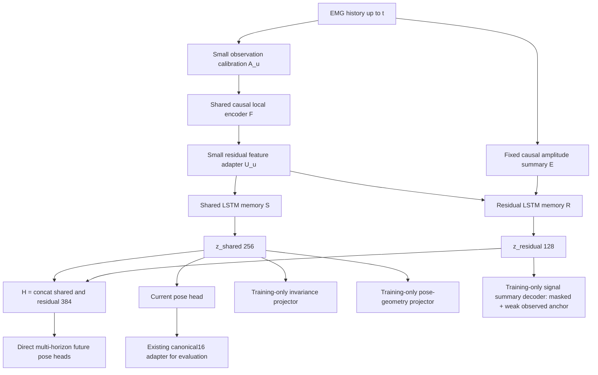

# HumanEngine-EMG v0.1：部分监督下的可扩展因果状态架构

日期：2026-09-19。角色：研究架构设计。状态：**PROPOSED — 尚未批准实施，未训练，未作性能声明。**

本报告落实原任务 A–O 与最终九项建议。根据本轮最新指示，**理论架构优先**；传感器通道数、采样频率、机器环境不是架构决策依据。文中的潜变量维度和实现参数是可复现的首版默认值，不是人体状态的自然维数。未修改已有科学流水线。

**推荐：共享因果观测编码器 + 两个在递归状态之前分开的记忆分支。** 输出 `H_t=[z_shared,t,z_residual,t]`；当前姿态读取 shared，未来姿态读取整个 H，信号摘要保留与遮挡恢复作用于 residual，弱噪声不变性和姿态几何约束仅通过 shared 的各自投影施加。使用联合训练，同时对共享前端和两个状态分支分别监测梯度。

这不是“姿态模型加五个 loss”。核心选择是：**限制当前已知任务支配全部高层记忆的权限，并保留一条有独立学习压力的补充状态路径。** 这也不是统计解耦、充分统计量或未知生理信息保留的证明。

## 0. 理论问题与可证伪假设

设真实人体状态为 `S_t`，个体生理属性为 `P`，测量条件为 `N_t`：

```text
S_(t+1) ~ p(S_(t+1) | S_t, P, interaction)
EMG_t   ~ p(EMG_t | S_t, P, N_t)
pose_t  ~ p(pose_t | S_t, P)
H_t      = F_theta(EMG_<=t; personalization)
```

我们只有其中少量可监督的投影。相同姿态可对应不同力、共同收缩与准备状态；相似 EMG 也可能对应不同接触条件。因此既不把 pose 当完整 S，也不声称 EMG 可以唯一识别完整 S。v0.1 的工作目标是一个**可扩展的任务相关状态摘要**，不是恢复不可观测状态的万能逆映射。

有限维压缩不可能保证保留所有尚未定义的任务信息。必须把“保留”具体化为：相对于 pose-only core，在相同数据、容量和探针预算下，保持当前 API 保真度，并改善未直接监督目标的冻结探针、可预测性和后续学习效率。信号摘要重建只是覆盖这些目标的代理，不等于覆盖全部生理信息。

| 类型 | 本报告的具体内容 | 可以怎样被否定 |
|---|---|---|
| 实现选择 | 分开两个 LSTM；H 拼接；梯度按表路由 | 正确实现与测试即可判断是否做到 |
| 表示假设 H1 | 分开高层记忆可减轻 pose 监督导致的信息损失 | 等容量单状态模型在 API、冻结探针及鲁棒性上持续支配它 |
| 表示假设 H2 | 信号摘要任务让 residual 获得有增量价值的信息 | residual 低秩，或 H 相对 shared 没有超出探针容量因素的收益 |
| 表示假设 H3 | 弱不变性与小型观测适配可改善跨用户转移 | 拿掉不变性后跨用户和新 API 都更好，或全量微调才有效 |
| 科学声明 | 未监督力信息可由冻结 H 读出 | 必须在独立、真实有力标签的数据上检验；本轮不成立 |

设计追求有选择地压缩已知测量扰动，同时保留幅值、跨通道关系与时间变化。**传感器噪声和生理变化的边界无法仅靠这些数据完全识别。** 不采用通用 subject-adversarial removal；受试者身份可同时编码电极条件与真实解剖/募集差异。

## A. 仓库检查与科学边界

### A1. 本轮读到的真实接口

以下路径相对项目根 `C:\Users\董伯言\Desktop\fingers\emg2pose_handstate`；方括号编号为本文证据键。

| 证据键 / 文件 | 核查内容 | 对新架构的影响 |
|---|---|---|
| R1 `baseline/emg2pose/config/experiment/regression_vemg2pose.yaml` | regression 不提供初始姿态，启用 state_condition | 保留 EMG-only 初始化原则 |
| R2 `baseline/emg2pose/config/network/tds.yaml`；`emg2pose/networks.py:327` | 卷积/TDS 前端，最终 64 维；总 stride 80，左上下文 1790 | 借鉴因果卷积 + 递归状态，不直接复制整段上采样流程 |
| R3 `baseline/emg2pose/emg2pose/pose_modules.py:43`、`:168` | 先插值特征，再 `[feature, previous pose]` 递归解码；窗口内重置 | 新 H 不通过上一帧姿态形成唯一状态通路 |
| R4 `baseline/emg2pose/config/pose_module/decoder/lstm.yaml`；`vemg_with_initial_state.yaml` | 84 输入、两层 512 LSTM、40 输出分 position/velocity，输出乘 .01 | 这是实际基线，不是抽象的“Conv+LSTM” |
| R5 `baseline/emg2pose/emg2pose/utils.py:100`；`data.py:265` | 20 维全部近零是 IK 无效标记；loader 提供 EMG、pose、mask | 保留官方 pose mask；新 lane 额外检查 finite/时间连续性 |
| R6 `representation/canonical_hand.py:415`、`:496`；`docs/CANONICAL16_CONTRACT.md` | 名称解析的 20→16 映射；公开转换会 detach 到 NumPy | 冻结适配器用于评估；若需可微 view，另写 index_select 并对齐黄金输出 |
| R7 `inference/predict_pose.py`；`docs/SESSION2_REPORT.md` | 现成 B0 推理包装器、模型哈希和旧验收记录 | B0 原样保存；不将其批量接口改写成新 core |
| R8 `docs/CONFIRMATORY_RESULTS.md`；`FROZEN_CONFIRMATORY_SPEC.json` | S3 当前记录已完成 77 人确认实验，43 人留出已永久 outcome-exposed | 旧审计中“尚不能运行”的状态不是当前结论；本轮不重跑、不重新挑选 DB9 模型 |
| R9 `bridge_audit/SESSION5_HANDOVER.md` | S5 封存；GT/pred decoder agreement 是自洽性，不是语义准确率 | DB9 只作外部姿态语义诊断，不定义 H 或训练主目标 |
| R10 `human_semantic_validation/BLINDING_SPEC.md`；`pilot2_external/README.md` | S6 标注盲法与独立开发分支 | 不读取答案、不在标注窗口计算模型端点、不挪用其结果选架构 |
| R11 `docs/emg2pose_paper.txt:795`、`:981`、`:1028` | 采集姿态先 IK、低通、插值；online 变体未开源 | 学习未来标签必须承认时间平滑；不能声称解决真正运动意图 |

本轮只读核查确认：基线子仓库 HEAD 为 `5f6f62b1a0a08426adffe55900842e75a8adb38c`，工作树干净；项目根不是 Git 仓库。原来根目录没有 AGENTS，本轮新增治理文件，不改冻结文档。旧 DB9 审计记忆仅用于定位需检查的 provenance，状态以当前文件为准；当前 S3 数字来自已存报告，本轮未重算。

### A2. 实际基线及不能继承的隐含假设

VEMG2Pose 前端为：`Conv(16→256,k11,s5)` → `Conv(256→256,k5,s2)` → TDS stage `(k17,s4,两块k9)` → TDS stage `(k9,s2,两块k5)` → 64 维。实测参数量约 598 万。其原生特征是 25 Hz，线性插值成 50 Hz 后送入 LSTM；前 12 个递归步骤输出绝对位置，随后把预测增量加到上一姿态。最后再插值到数据频率。[R2–R4]

**严格区分**：右侧上下文为零支持卷积的因果解释；但全窗口 `linear interpolate(align_corners=True)` 会使用下一个特征，且窗口长度影响插值网格。因此当前公开批量 forward 不具备已经验证的零前视流式保证。保留它作为 B0 的已冻结批量语义；新 core 直接在自己的因果时钟上更新，不沿用这条插值路径。历史文件中的“causal”表述不在本轮改写。

应继承：局部信号编码、持续状态、纯 EMG 运行、官方关节顺序与有效性。不要继承：pose-conditioned state 作为全部人体表示、每窗口强制重置作为部署语义、位置/增量硬切换、把上采样输出当独立观测。

### A3. 数据现实与冻结范围

当前官方 mini 有 30 个 HDF5 文件，**同一个用户、同一个 HDF5 session ID**，是 15 stages × 双手，不是 30 个独立 session。共 4,218,756 行。本轮打开的真实字段是 `time float64`、`joint_angles float32[20]`、`emg float32[16]`；旧文档的 joint float64 不能替代真实 schema。官方 `mini_split.yaml` 仅用其中 6 个文件，同用户划分不能形成跨用户证据。

全量 metadata 为 25,253 文件、193 用户、751 sessions，train/val/test 分别 17,136/1,950/6,167；metadata 存在不等于全量数据本地存在。当前 `full/` 与 `priority_pose_subset/` 没有 HDF5。旧 `data/emg2pose_dataset_mini/` 是不完整旧副本，有读取错误；不作为 HE 数据源。

当前 pose 来自低得多的独立采集频率，并经约 15 Hz 低通后插值。**+20 ms 预测尤其可能主要反映平滑和持久性**，必须设持久预测与因果外推参考；不能据此声称检测 motor preparation。没有可信 force、fatigue、contact、anatomical activation、intent 或绝对世界位姿真值。不从 stage 生成逐帧手势标签。

冻结 `baseline/`、`inference/`、`representation/`、DB9、S3/S4/S5/S6 的代码、输出、mask、映射、阈值和 provenance。本轮只在 `humanengine_design/` 写设计记录，新增根治理文件；将来代码另建 `humanengine/`。HDF5 ASCII junction 和环境只放在交接备注；不据此选择模型理论。

## B. 方法空间：借原则，不强行堆方法

来源详见文末 S1–S17。成熟度指相关方法本身，不意味着已经在这个任务和约束下验证。

| 方法 / 决定 | 核心原则与本项目收益 | 可能损害什么 / 新风险 | 成熟度、负担、v0.1 位置 |
|---|---|---|---|
| VEMG2Pose [S1] **KEEP/MODIFY** | 局部卷积 + 递归状态；连续 EMG 的自然参照 | 以 pose 反馈作为全部状态会缩窄表示；批量插值非流式契约 | 成熟、低至中；继承范式，不照搬 decoder/权重 |
| CPEP [S2] **MODIFY** | 训练时用 pose teacher 塑造 EMG | 冻结 pose-MAE + hard contrastive 会把相近状态当负样本；整表示对齐易丢非姿态信息 | 中；不重做其两阶段流程，不复制行为组标签协议 |
| EMBridge [S3] **MODIFY** | 避免把相近姿态机械视为负样本的候选归纳偏置 | Q-Former、masked pose reconstruction 增加复杂度；pose 仍非全状态，soft并非已证实普遍更优 | 新且中高负担；借软关系原则，暂不引入整套结构 |
| GenENet [S4] **MODIFY** | masked **RMS 时空图**学习可用于 EMG 表示 | 不是 raw waveform MAE；图像 crop/flip、高 mask率、不同数据域不可直接迁移；后续有力监督不等于冻结力保留 | 中；借摘要目标，不借图像增强/非因果 ViT |
| 原始 waveform MAE **REPLACE** | 保留细节最直接 | 随机相位/传感器噪声占容量，遮挡细节可能不可预测，迫使模型做压缩器 | 简单但目标错配；改为局部幅值与粗频带摘要 |
| 同头 clean-summary anchor **KEEP** | 很弱的可观测摘要重建直接约束R保留当下测量；弥补masked仅学条件可预测结构 | 可能只复制E或保留仪器噪声，不是未知 physiology 证据 | 简单自编码原则、低负担；同M头、无新增encoder，配方为本文设计 |
| VICReg [S5] **MODIFY** | 视图一致 + 反坍塌 + 去冗余，不需要负样本 | 不变性可误删生理幅值；投影健康不代表 H 健康 | 成熟、中；只对 shared 投影和非常弱的测量噪声使用 |
| Barlow Twins [S6] **DELAY** | 交叉相关接近单位阵 | 与 VICReg 覆盖重叠；时间相关样本使相关估计失真 | 成熟、低；若 VICReg 数值问题，作为替代而非叠加 |
| CPC [S7] **KEEP as B5** | 用现在的状态区分未来特征 | false negatives、身份捷径，负样本策略影响大 | 成熟、中；代表通用预测 SSL 的对照，不加到 FULL |
| TS2Vec [S8] **DELAY in FULL** | 时间/实例多尺度一致，通用时序表示 | 原始上下文/评估不自动等于严格因果；和不变性/时间目标重叠 | 成熟、中；若做基线须标明因果改造，B5 首选 CPC |
| I-JEPA [S9] / latent prediction **DELAY** | 预测目标表示，免追逐每个像素/采样点 | 目标可能忽略同样的未知信息；EMA+mask+因果性增加不可辨识问题 | 中高；只有摘要目标明显失效再分支验证 |
| data2vec [S10] **DELAY** | masked student 预测 EMA teacher 多层上下文特征 | teacher 可继承 pose 偏置；全上下文 target 属特权信息；有 bootstrap 坍塌风险 | 成熟但迁移负担中高；目前固定目标更可诊断 |
| Relational KD [S11] **KEEP/MODIFY** | 用批内关系而非逐维向量匹配，允许不同表示维数 | 手选姿态度量可能不适合跨用户；与监督 pose 部分重复 | 成熟、低；用固定 pose 几何作弱正则，不叫 EMBridge 复现 |
| shared/private 思想 [S12] **MODIFY** | 对任务施加不同参数权限，减少高层目标竞争 | DSN 原框架的正交/域分离假设未获本项目支持 | 成熟原则、中；保留结构性分工，拒绝独立/正交约束 |
| 观测适配器、低秩适配思想 [S13] **KEEP** | 通用状态 + 小型可替换个体参数，校准便宜 | pose 校准可能损害未监督生理信息，收益需实测 | 成熟、低；输入 affine + 小残差 adapter，不上 MAML |
| 概率 belief / Kalman / latent dynamics **DELAY** | 状态估计强调递归与不确定性 | EMG 观测方程、过程噪声和可观测性未建立；“belief”名义大于证据 | 成熟理论、中高迁移；先用确定性状态，不谎称贝叶斯后验 |
| TCN / Transformer / Mamba [S14] **DELAY as alternatives** | 分别是有限卷积记忆、注意力记忆、选择性状态递归 | 没有当前需求证明更换更复杂骨干优于成熟递归；后端/缓存诊断成本 | 各有成熟实现；基于观测到的容量/延迟问题再比较 |
| subject adversarial / 强增益不变性 **REJECT by default** | 可去除域相关性 | 身份与真实生理纠缠；域不可预测不等于可泛化 | 不以“subject-free”为目标 |

### B1. 新引入原则为何值得

**RKD-inspired pose geometry**：用 train-only、固定尺度的关节几何替代 learned pose teacher，避免先训练一个老师才能训练 FULL。它解决“姿态监督虽可被头部拟合，latent 邻域却任意扭曲”的问题；额外假设只是投影空间应保留姿态距离，不是所有 H 都应相近。负担低；主要失败是冗余正则或错误度量，因此它是第一个条件性删减候选。

**来自语音/通用 SSL 的 data2vec 思路**认真评估但延后：一个正在被 pose 训练塑造的 EMA teacher 无法可靠地恢复自己已经丢掉的信息。EMA 缓解优化噪声，不是信息保留证书。若固定频带目标过窄，之后可以比较独立 EMG teacher；必须控制额外数据/预训练预算，并保留坍塌诊断。[S10]

**shared/private 借鉴**只用于参数分工。HumanEngine 的 residual 不是 domain-private，shared 也不是 domain-invariant 真因子；不继承 DSN 的正交损失或域标签目标。[S12]

不加独立 force、fatigue、contact head、MoE、GNN、MAML、OOD 模型或 conformal layer。没有真值时，增加这些输出只会把表示意图变成未经验证的 API。

## C. 推荐 HE-Core v0.1 数据流



图中所有路径只读取 `<=t` 的 EMG。训练的 masked 视图在图的最顶端替换 X；**幅值支路、编码器、归一化、缓存都必须看到同一份被遮挡输入**。不能从 clean pass 复用递归状态，否则会泄漏目标。

| 组件 | 首版规格（实现默认值） | 理论职责 |
|---|---|---|
| `A_u` | 各输入轴 `a*x+b`，零校准时 a=1,b=0；参数与 core 分开保存 | 低维观测映射，不强迫身份信息消失 |
| `F` | 因果局部卷积，输出 128；三层下采样 + 两个轻量深度可分离残差块；逐时刻 channel LayerNorm | 共享局部特征，不先压成姿态 |
| `U_u` | `f + W_up tanh(W_down f)`，128→8→128，无 bias；默认 identity | 小型个体特征适配 |
| `E` | 每输入轴短窗 log-RMS，固定 train-only 尺度，**在个体 affine 和前端归一化之前**取值 | 为 residual 留一条不强制消除绝对幅值的入口；不是新 API |
| shared memory | 1 层 LSTM，128 输入，256 hidden；无 pose feedback | 已知 API、稳定结构、预测所需状态 |
| residual memory | 1 层 LSTM，`128 + dim(E)` 输入，128 hidden | 补充记忆；接受信号目标和未来目标，避开当前 pose 的直接支配 |
| current pose | 256→128→20，SiLU 隐层，线性输出，弧度 | 已知的当前运动学 API |
| future pose | 384→128→60，reshape 为 3×20；直接绝对姿态预测 | 原点 t 的多时间跨度预测；接口按 target family 扩展 |
| signal decoder M | 128→128→`dim(signal_target)`；逐 token 小头，clean/masked共用 | 要求 residual 自己承担当下摘要保留与遮挡恢复，避免只借 shared 解题 |
| invariance projector | 256→128→32，SiLU，无最终 norm | 仅训练使用，VICReg 作用于此 |
| pose geometry projector | 256→64→32，SiLU，无最终 norm | 仅训练使用，几何关系的缓冲空间 |

`H_t` 只拼接两个 learned hidden outputs；不把 E 原封不动拼成 H 来人为制造“保留了信息”的结果。E 虽是输入支路，仍可能成为近路，必须单独做 E-only 探针。

## D. 为什么这套理论结构

| 需求 | 设计中的具体作用 | 不能由此推出的结论 |
|---|---|---|
| 信息保留 | residual 独立记忆 + signal-target 学习压力 + 幅值入口 | 任意未知任务信息均被保存 |
| 抑制已知扰动 | 只在 shared 投影上施加弱测量噪声一致性 | 所有用户差异都是 nuisance，或 shared 已完全不变 |
| 已知 API 精度 | current pose 有直接监督和独立 head | 当前 pose 好就等于人体表示好 |
| 时间预测 | future head 读全 H，鼓励保留对演化有用的线索 | 模型必然利用了姿态历史以外的信息，或短时平滑预测就是意图 |
| 跨用户 | 用户平衡采样、无身份分类驱动、单独适配、留人验证 | 用户识别率低等于泛化好 |
| 低成本个体化 | core 冻结，只改观测 affine/小 adapter | 校准无需标签或无需实验就一定有效 |
| 因果运行 | 显式递归状态，右对齐局部编码，不做未来插值 | 有限历史预热时间等于每步输出延迟 |
| 新 API | 冻结 H 后加廉价 head，再决定是否需要 core 扩容 | 所有未来 API 可完全不改 core |
| 部分监督 | 各 loss 用各自 availability mask；pose 缺失时仍有信号 SSL | 用伪造 force/intent 标签补齐监督 |
| 可诊断 | 共享前端及分支分别测梯度、rank、增量 probes | 多目标冲突完全由分支结构消除 |

## E. 主要替代方案与拒绝理由

### E1. H 的结构比较

| 候选 | 长处 | 为什么 v0.1 不选 / 何时重看 |
|---|---|---|
| 单一 rich latent + 多头 | 最简、容量利用灵活 | 所有高层递归参数同时受姿态/不变性/重建支配，难定位信息牺牲；保留为等容量结构反证 |
| **shared + residual，分开递归** | 直接梯度权限明确，允许不同任务保留不同记忆 | 选它；仍有共同前端风险与重复编码成本 |
| explicit + predictive + residual 三分支 | 看似语义清楚 | 把“预测”过早固化成独立生理因子，增加接口和容量混杂；future 先读全 H |
| 一个 recurrent belief + API readout states | 可建统一动力学模型 | 确定性 LSTM 不等于 posterior belief；当前无可识别的生成/噪声模型 |
| fast/slow 生理层级 | 适合长期疲劳/上下文等任务 | 当前缺少这些标注与足够长的校准证据；先观察长程探针是否失败 |
| 完全独立两个编码器 | 最强的梯度隔离 | 成本高、失去低层共享；只有共享前端持续冲突并伤害 residual 才做这个反证 |

**分支点选在共享局部前端之后、递归记忆之前。** 很早分开会失去基础信号共享；同一个 LSTM 之后分两个 projection 则不能阻止 pose loss 改写所有记忆参数。这里保护的是“高层参数不直接收到某类梯度”，不是整个信息通路不受影响。前端仍是公共瓶颈，必须把它当独立诊断对象。

### E2. 骨干与预测机制

Conv+LSTM 是首选：局部 EMG 结构与累积状态职责明确，缓存和梯度能分组审计。TCN 有稳定有限感受野，但长历史依赖需要增大缓存/深度；causal Transformer 有更灵活检索但没有当前数据证明这种需求值得成本；Mamba/SSM 有吸引力，但在发现长程记忆或部署瓶颈之前更换不会直接解决信息保留问题。不要把“使用 SSM”当作已经有了生理状态模型。

未来状态先采用**直接 multi-horizon readout**，不加入自回归 latent rollout。当前没有足以识别完整 HumanState 转移的标签；递归生成 latent 会把状态定义和目标正确性同时变成未知项。每个未来 head 以 `(target_family, horizon)` 注册，v0.1 只有 pose。未来 force head 可以读取同一个 H，不把未来状态的 schema 写死为 pose。

当前姿态不用 previous predicted pose 作主输入，不做 position→velocity 的硬切换，以免引入必须用姿态才能延续的状态瓶颈。姿态平滑暂不加额外损失；数据已经平滑，过强平滑可能抹掉准备期信息。

### E3. 保留目标与对齐替代

| 目标选择 | 决定 |
|---|---|
| raw 或仅预处理 waveform patches | 不作默认重建，随机相位细节与 nuisance 成本过大 |
| 全频谱/时频图 MAE | 比 waveform 有结构，但细粒度频谱仍可能保留采集特征；图像增强没有生理正当性 |
| **log-RMS + 粗 log-band energy** | 选作透明、固定的多统计量目标；masked恢复可预测结构，弱clean anchor约束实际观测保留，易诊断遗漏 |
| learned latent / EMA teacher target | 后续替代分支；不能假定 teacher 比 H 更保真 |
| 直接将 H 或整个 shared 对齐到 pose | 拒绝，强迫未被 pose 解释的信息消失 |
| frozen Pose-MAE + hard InfoNCE | 暂缓；老师预训练和 false negatives 增加混杂 |
| **shared 的小投影 + soft relational geometry** | 选择；无对比负样本、无预训练依赖，仍须证明增量价值 |
| Q-Former / cross-attention | 当前固定维 pose 并不需要复杂 token 汇聚 |

## F. 精确定义 H 与两支表示

```text
f_t = U_u(F(A_u(x_<=t)))
e_t = E(x_<=t)                          # 固定、因果，保留测量幅值
(hS_t,cS_t) = LSTM_S(f_t, (hS_prev,cS_prev))
(hR_t,cR_t) = LSTM_R(concat(f_t,e_t), (hR_prev,cR_prev))
z_shared,t = hS_t          in R^256
z_residual,t = hR_t        in R^128
H_t = concat(hS_t,hR_t)    in R^384
```

完整运行状态 `RuntimeState=(hS,cS,hR,cR,conv caches,summary buffers,stride phase,timestamps,quality flags)`。H 是给探针/API 的 learned summary；**H 不含所有 c/cache，因此不声称它是完整 Markov state 或贝叶斯 belief。** 若新 API 需要整个 H 历史，允许小型因果 sequence probe，但要与单时刻 probe 分开报告成本。

| 表示 | 被鼓励包含 | 不假设 | 读取者 / 直接训练来源 | 验证 |
|---|---|---|---|---|
| shared 256 | 可监督结构、稳定表征、未来动力学线索 | 无身份、无幅值、纯运动学、跨人必然等价 | current/future heads、两个投影；pose/future/VICReg/alignment | 当前/未来 pose、跨用户及扰动表现 |
| residual 128 | 幅值/谱统计、预测所需补充线索 | pose-free、subject-private、正交、独立或力专属 | signal decoder、future head；signal/future | H 相对 shared 的增量、E-only 对照、未来新 API |
| full H 384 | 两者可联合使用的信息 | 完整生理状态、充分统计量 | future head、冻结 probes、未来新增 API | 等预算探针及新任务迁移、Pareto 是否被支配 |

不加互信息最小化、正交或 shared/residual 去相关损失。两者重复编码姿态并不违规；重复可提高鲁棒性。判断 residual 价值的重点是**条件增量**，不是 residual 是否能单独预测姿态，更不是它是否不能预测姿态。

## G. 精确 loss routing

### G1. 梯度权限图

符号：`F` 共享局部前端；`S/R` 两个 LSTM；`Q/P/M/V/G` 分别为 current/future/signal/invariance/geometry heads。`A/U` 个体组件在通用训练中保持 identity 且冻结；`E` 无可训练参数。

```text
clean EMG  ─ A ─ F ─ U ─ S ─ Q ─ L_current_pose
                        │     ├ V ─┐
                        │     ├ G ─ L_pose_geometry ← stopgrad(fixed pose relations)
                        └ R ─┐     │
                      S ─────┴ P ─ L_future_pose ← stopgrad(q[t+h])
                        R ───── M ─ 0.1 L_observed_summary ← stopgrad(summary(clean EMG))

weak-noise EMG ─ A ─ F ─ U ─ S ─ V ─┴ L_VICReg(clean V, noisy V)

masked EMG ─ A ─ F ─ U ─ R ─ M ─ L_masked_summary
      └ E(masked EMG) ────┘          ↑
                              stopgrad(summary(clean EMG))
```

| Loss | F | S | R | Q | P | M | V | G | teacher/targets | A/U during universal training |
|---|---:|---:|---:|---:|---:|---:|---:|---:|---|---|
| current pose | ✓ | ✓ | — | ✓ | — | — | — | — | 不回传 | 冻结 |
| future pose | ✓ | ✓ | ✓ | — | ✓ | — | — | — | 不回传 | 冻结 |
| masked summary | ✓ | — | ✓ | — | — | ✓ | — | — | 不回传 | 冻结 |
| observed summary（signal项内弱anchor） | ✓ | — | ✓ | — | — | ✓ | — | — | 不回传 | 冻结 |
| VICReg | ✓ | ✓ | — | — | — | — | ✓ | — | 两个 student 视图都回传 | 冻结 |
| pose geometry | ✓ | ✓ | — | — | — | — | — | ✓ | 固定 pose 几何，不回传 | 冻结 |

“—”是参数梯度不应出现，不是 loss 数值为零。测试必须检查目标参数集合；一个 forward 经过某分支不代表该分支应获得梯度。当前 pose 仍可通过 F 间接改变 residual 的输入分布，不能宣称完全隔离。

### G2. 目标卡片与公式

**OBJECTIVE: L_current_pose**

- purpose = 学好当前唯一有可靠直接标签的 API。
- source representation = clean `z_shared`；head = Q。
- target = 官方有效区间上的 20D pose，弧度；损失 `mean_valid |qhat-q| / 1 rad`。按窗口先取有效均值，再按用户平衡汇总。
- gradients update = F,S,Q；blocked = R 递归、其他 heads、标签、冻结 A/U。
- benefit = 给 shared 明确任务；risk = pose 支配共享前端，缺失掩码选择偏差。
- diagnostic = 各关节 MAE、canonical16 MAE、F 梯度份额、有/无姿态标签样本组成。
- 不增加 canonical16 的重复训练 loss；它是官方 20D 的确定投影，重复加权会悄悄改变关节重要性。

**OBJECTIVE: L_future_pose**

- purpose = 鼓励 H 保留有助于预测的线索；是否超过当前/历史姿态所含信息需要条件性检验。
- source = clean full H；head = P，三时间跨度直接输出，无 ground-truth 当前姿态输入、无 teacher forcing。
- target = 同一序列的 `q(t+h)`，h∈{20,40,100 ms}；各 horizon 的有效 L1 独立平均，随后均等平均。缺标签 horizon 不进入分母。
- gradients update = F,S,R,P；blocked = Q、其他 heads、targets。
- benefit = 允许 residual 对预测提供补充；risk = 仅学标签平滑/持久性，或只用 shared。
- diagnostic = horizon 曲线；对比持久预测 `qhat(t)`、仅用历史预测姿态的因果线性外推，以及固定小型 pose-history-only 因果预测器（同历史范围、horizon、读出预算）；另报使用 GT pose history 的特权运动学参考；H-vs-S 增量。GT参考依赖发布的平滑标签，不是可在线获得的观测；超过简单外推只能证明预测更好。
- 不以这项 loss 单独证明 motor intent。若 +20 ms 无法超过合理持久参考，先核查标签时间带宽，不马上换骨干。

**OBJECTIVE: L_masked_summary**

- purpose = 在当前 API 之外施加可解释的信号保留压力。
- source = **masked z_residual only**；head = M；不让 decoder 从 shared 或 clean 原始摘要跳接。
- target = clean、已发布预处理 EMG 的短窗 log-RMS + 较长窗五组粗 log-band power；每轴六项。窗口只覆盖 `<=t`；尺度仅从 core-training split 估计并冻结。名称是 signal summary，不是“无噪声生理真值”。
- loss = target-wise train 标准化后的 smooth-L1(delta=1)，按被遮挡轴/目标项均值；只在相应目标的**整个支持区间被遮挡**时计分。
- gradients update = F,R,M；blocked = S、Q/P/V/G、clean target、A/U。
- benefit = 给 R 独立责任，减少 phase reconstruction 成本；risk = 摘要过窄、保留仪器频谱、遮挡不可预测、幅值近路、decoder 自己补全平均值。
- diagnostic = 相比全局均值、历史保持和小型线性上下文预测器的提升；新 API probes；频带贡献；corruption-only probes；E-only 与 learned R 对照。
- 不使用 full-H decoder：它可能完全依赖 shared 而让 R 空转。R-only 是可诊断的设计取舍，若将来证据证明需要联合重建，再单独比较。

**OBJECTIVE FAMILY: L_signal = L_masked_summary + 0.1 L_observed_summary**

- `L_observed_summary` 用已经算好的 **clean R** 经过同一个M头，重建该时刻完整可见的同一组固定信号摘要；不加encoder、teacher或额外前向视图。有效项为EMG有效且目标窗口完整的所有轴，不要求pose有效。
- observed与masked各自先按有效项平均，再按上式组合；不是把更多clean token直接混入masked分母。两子项独立记录损失、梯度与target数量。
- gradients update = F,R,M；blocked = S及其他heads、targets、A/U。两视图不能共享隐藏缓存；clean分支参与另一个合法loss不允许它进入masked输入。
- purpose = 完全masked预测主要学习条件可预测结构，可能忽略不可预测的即时测量变化。observed anchor直接要求一小部分实际幅值/谱统计可从clean R解码，弥补这个明确缺口。
- benefit = 在不追逐waveform相位的情况下，对选定观测量建立直接保留压力；risk = E-copy与传感器摘要压缩捷径、弱权重可能不够、固定统计覆盖仍然有限。
- 若R复制E的一部分，这对“保留被选中的观测量”可以是成功，对“学会未知生理”不构成证据。须以E-only/raw参考和新的有标签任务区分两者。任何声明仍不能覆盖motor-unit timing、未选定跨轴相位或任意未知变量。
- 该组合是本文的设计配方，采用普通自编码/遮挡恢复原则，不冒充GenENet或某篇论文的原始loss。五个objective families保持不变：current、future、signal、VICReg、geometry；signal内部两个作用需分开诊断。

**OBJECTIVE: L_VICReg**

- purpose = 对有物理依据的弱测量噪声建立局部稳定性，并防止投影坍塌。
- source = clean 与 weak-noise 两份 z_shared；head = 同一 V。
- target = 对应时间的另一 student projection；**两侧都回传**，不是 BYOL stop-gradient。
- formula = `L_inv + L_var + 0.04 L_cov`；inv 为两视图均方差；var 为两视图各维 `relu(1-sqrt(var+1e-4))` 的平均；cov 为中心化样本协方差非对角平方和除维数，两视图平均。样本方差使用 N-1；至少64个时间分隔anchors、8个不同recordings及4用户，低于支持时跳过并计数；正式batch默认8用户。32维投影若N≤32无法同时满足满方差与零非对角协方差，不能用重复邻帧冒充独立支持。
- gradients update = F,S,V；blocked = R、其他 heads；fixed view generator 无参数。
- benefit = 轻量局部鲁棒性；risk = 不安全 invariance、利用 session 差异满足方差、投影健康而 S 坍塌。
- diagnostic = 分别测 V 和 S 的 rank、跨用户/生理幅值 stress、各 loss 对 F/S 的冲突。
- v0.1 默认只用小幅独立 additive measurement noise；gain/offset/channel dropout 是压力测试，**不是默认等价视图**。

**OBJECTIVE: L_pose_geometry**（替代完整 CPEP/EMBridge alignment）

- purpose = 给 shared 的小投影一个与姿态结构一致的邻域，而非逐维压到 pose。
- source = clean z_shared；head = G；teacher = 固定 `T(q)=(q-mu_train)/s_train`。
- target = 对不同anchor pairs定义距离 `r_ij=sqrt(sum((v_i-v_j)^2)+1e-8)`，关系为 `d_ij=r_ij/(mean_pairs(r)+1e-6)`；teacher取v=T(q)，student取v=G(S)；loss = `mean smoothL1(dG-dT,delta=1)`。微小epsilon是本实现的数值保护，主体为RKD的归一化关系。[S11]
- `s_train=max(train std_j,0.1 rad)`；常量写入 manifest。floor 避免几乎静止关节控制距离；未来可物理加权，但不得用测试集挑权重。
- pose teacher **无学习参数、不预训练、不 EMA**。所有 targets stop-gradient；student 的 pair-mean 正常参与反传，不偷偷 detach 更改目标。
- gradients update = F,S,G；blocked = R、Q/P/M/V、pose target、A/U。
- benefit = 无硬负样本、无 teacher 训练依赖；risk = 与 current pose 冗余、错误度量、近似同 pose 不同 force 被投影合并。
- diagnostic = 几何 stress、G 的方差、H-vs-S 探针、移除本项的 Pareto 变化；该 loss 仅约束 projection，但梯度仍会修改 S/F。
- anchor 至少跨8个序列且4用户，排除自身和同序列过近pair后至少128对；teacher的未加epsilon平均欧氏距离<1e-4则跳过并记录。student对应均距<1e-4时仍以有限公式计loss，并记录degenerate_student；连续3次诊断近坍塌则停止该development run检查梯度/投影初始化，不能静默跳过或暗中重置head。不得靠同session连续姿态重复撑大样本数。

### G3. 权重与协同边界

首个可复现的 FULL 配方：

`L = 1.0 L_current + 0.5 L_future + 0.2 (L_masked + 0.1 L_observed) + 0.1 L_VICReg + 0.05 L_pose_geometry`。

这是**待测量的起始尺度**，不是最佳权重结论。各损失按有效项归一化；缺标签不把 loss 除以全 batch 而被稀释。所有项 step 0 启动，统一 LR warm-up，不先完成任何单任务训练。先用固定权重诊断，避免把自适应权重机制变成第六个未知量。

预期协同：pose 提供稳定 API，future 连接两个状态，signal 给 R 保留/恢复的独立职责，弱 invariance 减少小扰动，geometry 约束已知结构。预期冲突：signal 与 invariance 的保留/丢弃方向；observed 与 masked 的实际值/条件估计目标；pose/geometry 与未来非姿态线索；F 被多目标竞争。**冲突并不自动意味着错误；只有与泛化/信息保留退化对应的持久冲突才需要改法。**

## H. FULL 联合训练与实验有效性

### H1. 同时学，不靠串行预训练拼 FULL

每个 optimizer step 具有三个视图：clean（current/future/observed-summary/geometry/VICReg 一侧）、weak-noise（只需 F/S/V）、masked（只需 F/R/M）。三个视图共享参数，各有独立缓存与状态计算；不能把 clean recurrence 借给 masked。所有五个目标族及signal两个子项从第一步开启，没有先训练 pose、再加 SSL 的必经阶段。teacher 固定，无训练和 EMA 更新。

默认 AdamW，LR 3e-4、weight decay 1e-4，bias/norm 不衰减；前 500 步统一 LR warm-up，之后 cosine。global grad clip=1.0；记录裁剪前梯度以及被裁剪步比例。混合精度用于主训练，方差/协方差、损失缩减及诊断累积用 FP32。这里是首轮可复现参数，不是理论最优。

不预设 alignment 退火、future 逐步增强或 masked 中途关闭。若辅助项早期持续主导且 API/representation 同时退化，停止该 development run，记录原因后启动一个明确标记的权重对照；不静默更改同一次 FULL 的假设。

### H2. 时间、标签与 batch

- 每条训练样本保留 `user,session,side,sequence,start/end,timestamps,emg_valid,pose_valid`；stage 仅可用于报告数据组成，不作为姿态语义标签或对比正负依据。
- core-training、development users/sessions、最终 test 必须由 manifest 固定。左右手的同步记录、相邻窗口和同一校准片段都按 source group 归属，不能跨集合泄漏。
- 先均匀采用户，再采 session/recording，再采时间窗，避免长 recording 决定梯度。一个 batch 默认 32 windows、至少 8 用户，不让一个用户占超过 1/4。
- 默认每窗 1 s burn-in + 5 s 计分。burn-in 在每个视图自身输入上运行，不累计 loss；detach 后对后段 BPTT。训练窗之间不携带状态。另做持续整序列验证，检查有限窗训练的长时漂移。
- pose targets 只在模型的较低输出节拍对齐读取。使用发布标签，不人为把相邻插值值当独立统计样本；不另做非因果平滑、跨无效区插值或逐采样点速度/加速度标签。
- future mask 为：同一 recording，目标时间在范围内，EMG 输入历史有效，且 `[t,t+h]` 的 pose 路径无无效间隙。每个 horizon 单独 mask；序列尾端没有标签就不计分，不 clamp 到末帧。
- IK 无效但 EMG 本身有效的区间可参加 masked/VICReg；不能用 pose-valid mask 全面筛掉 SSL 数据。数值无效 EMG 或采集断点触发状态断开。
- VICReg 每 window 取两个间隔至少 1 s 的 anchors，32 windows提供64 anchors；报告独立用户/序列数并满足G2最小支持。G 可使用同一组有效 pose anchors，排除同序列间隔<200 ms的pairs。小 batch 不足时该辅助目标跳过并报告，不能用连续帧凑数；正式 FULL 必须满足 batch 构造要求。单用户mini只可跑工程数学/接口检查，不能称科学意义的VICReg/FULL实验。

训练相关性的统计单位是用户/独立 session，而不是 token。置信区间采用用户层级重采样，必要时嵌套 session；不能对几百万个插值样本做 i.i.d. bootstrap。

### H3. mask 与 augmentation 的权限

**Masked view**：在连续目标支持长度内，随机遮挡约 1/8 输入轴；当前数据默认至少一轴且通常两轴。每段维持 100 ms，下一段可换轴。以零替换被遮挡输入。由于发布输入已高通且近零中心，零是固定 missing placeholder；不引入 clean target 值。masked loss 只在段末、对应轴全部目标支持被遮挡时计算。掩码不跨 recording，不在 latent 上遮完却保留 clean amplitude 支路。

短 RMS 支持 40 ms，频带支持 100 ms；target 的两者都在段末完全被遮挡。先构造 clean target，再从独立 masked 输入构造学生所有路径；严格区分它们。频带相邻能量之间存在统计相关，任务可能预测条件均值，所以还必须有均值、history-only 和简单跨轴预测对照。重建误差低不自动说明 R 保留了完整信号。

**Weak-noise view**：`x'=x+epsilon`，零均值独立噪声 std 为训练文件已知测量噪声尺度的 0.02 倍；若将来设备没有可靠噪声尺度，在新域先禁用这项增强并标记域适配，不能用每窗 EMG 活动强度当噪声尺度。其力度本身是暂定工程值，不是生理等价性的定理。

| 变换 | v0.1 权限与理由 |
|---|---|
| 极小 additive measurement noise | 默认一致性视图；固定训练尺度，观察幅值敏感任务是否受损 |
| channel gain ±5%、小 offset | 仅 stress；gain 可能是真实募集/力，offset 可能与已发布滤波不一致 |
| 限量 channel dropout | masked 任务和 stress；不把完全失去测量视为等价人体状态观测 |
| 时间遮挡 | 恢复任务可用，v0.1 主配方优先整支持轴遮挡；不做时间置换不变性 |
| arbitrary channel permutation、随机 sign flip | 禁止默认使用；破坏拓扑/极性或重复官方左手处理 |
| time reversal、aggressive warp、强频率变形 | 拒绝；改变动力学或生理证据 |
| 官方 ±1 circular channel roll | 不自动继承；将来作为有依据的电极旋转压力测试，需同时验证空间语义 |

### H4. 检查点与公平基线

| 名称 | 训练原则 | 目的与公平边界 |
|---|---|---|
| B0 | 冻结官方 VEMG2Pose | 外部历史参照；其额外训练数据/权重来源与批量因果差异单独标注，不能当等预算结构对照 |
| B1 | 同HE骨干、current+future两个监督目标；可选另记B1_current仅当前pose并从H读出 | 主参照保留相同heads、两支有效训练容量、数据量/步数；只读S而闲置R的版本不冒充等有效容量对照 |
| B2 | signal-summary SSL（masked+弱observed） | 测信号自监督原则；冻结core后用统一pose/future probes；清楚标注不等于纯MAE |
| B3 | VICReg SSL | 测增强不变性原则；同 probe 协议 |
| B4 | pose-informed geometry/contrastive baseline | 首选相同骨干的 current+geometry；标名 HE pose-informed baseline，不冒充原 CPEP/EMBridge 复现 |
| B5 | causal CPC | 测通用未来特征预测；以同数据、同总算力报告，负样本不跨集合 |
| HE_FULL | G 的五目标联合 | 主要假设，先训练它，再由 K/L/M 选择对照 |

所有 baseline 的开关与读取方式必须实现，但**不要求先跑完整矩阵才有 FULL**。B2/B3/B5 本身没有训练 API head，其读出成本单独计算；不能将其未训练 head 与 FULL 比精度。报告同数据 exposure 与同 wall-clock 两种成本视角，三视图 FULL 不能只按 optimizer steps 宣称等算力。

为避免把“未训练的一半latent”当公平SSL基线，B2的signal decoder、B3的projector、B4的pose/geometry heads、B5的CPC query都读取**整个H**并训练两支递归。它们使用相同前端和递归容量，head输入维数变化如实计入参数，优先使总参数差异在5%内。B4明确是pose-informed principle baseline，不是FULL的单项消融。可选B1_current同样从H读当前pose，保持两支被训练；主要B1则与FULL一样current读S、future读H。消融M严格保留FULL原路由，两类对照不可混称。

B5最小规格：H经各horizon独立线性query投到64维，预测未来F特征的64维线性projection，h与FULL一致；L2-normalized dot-product/temperature0.1做InfoNCE，每anchor用训练集合中其他recording的128个target negatives，不用stage标签挑正负。query只用<=t；future特征仅作为训练target，target encoder梯度正常参与CPC，不增EMA teacher。记录同用户负样本比例与身份捷径；它不是FULL的新增目标。

初轮保存 step 0、500、2000、5000、10000 检查点；每 1000 步做固定 development evaluation。初轮完整 probe 在 0/2000/10000；最终选点用预登记 Pareto/约束，不使用 test。若后续稳定训练更长，另记 run 和预算，不把未收敛的初轮当负结果。

## I. 个体化：适配观测，不重建整个人体空间

通用参数 F/S/R 和所有 API heads 在个体化时冻结。每个用户/会话只保存 `A_u` 的 affine 和 `U_u` 的 rank-8 adapter；不引入带有 user-ID 标签语义的 lookup embedding。零校准默认 identity；U 的 down 初始化为固定随机矩阵、up 为零，从 identity 开始，避免两层都为零导致梯度阻断。

| 可用校准时长 | 默认可更新组件 | 预注册开发默认步数 | 解释 |
|---|---|---:|---|
| 0 s | 无 | 0 | universal core；不得偷偷用测试全序列统计量 |
| 5 s | A 的 a,b | 10 | 强 identity 正则，数据不足以保证改善 |
| 10 s | A 的 a,b | 20 | 同一参数族，观察预算曲线 |
| 30 s | A + U | 50 | 新增小型非线性观测映射；独立验证过拟合 |
| 60 s | A + U | 100 | 保持 core 冻结，不因更多数据自动全量 fine-tune |

这些预算默认指**有同步、有效 pose 标签的专门校准数据**；不是把提示用户做某动作当真实角度。若只有无标签 EMG，v0.1 保持 identity 并报告 uncalibrated；可记录信号质量，不做按全窗方差自动白化。以另一个明确标记的后续实验探索无监督 adaptation。

校准目标为 current pose loss + `0.01 mean((log a)^2) + 0.01 mean(b^2/s_noise^2) + 0.01 mean((U(f)-f)^2)`；a 用指数参数确保为正，log a 限于 ±log2，b 限于 ±0.5 个训练 noise-scale。若 s_noise 不可定义则先不优化 b，不虚构噪声参数。LR=1e-3，步数和正则从 development 用户统一选择后冻结，不能对每个测试用户用其评估结果挑选。

校准样本为嵌套时间预算，同一源用户固定片段，按原始经过秒数计费；有效标签覆盖率另报。不挑“最容易”的动作。评估使用未参与校准的后续时间块和独立 session，留足目标支持/历史长度的隔离区。与 head-only、无校准相比；full fine-tune 只作较昂贵上限，不是默认策略。

幅值 E 在 A 之前提取，保留观测单位；这保护了一个入口，但并不保证新用户的 force 标尺正确。pose 校准会改变供给 R 的 f，所以必须同时检查 R probes 和 signal targets。runtime 加载 adapter 需匹配 core hash、输入 schema 和统计量版本，加载后 reset 状态，禁止在未重置的记忆里突然换用户参数。

## J. 因果递归契约

```text
state = HE.init_state(batch_size, adapter_id, device)
outputs, state = HE.step(new_emg_chunk, state, timestamps)
```

`outputs` 含 `{timestamp, H, z_shared, z_residual, pose20, future_pose[h], warmup, input_quality, model_id, adapter_id}`。当前 explicit API 只有 intrinsic pose 和未来 pose；canonical16 是冻结 projection，DB9 semantics 是独立、明确领域限制的后处理。未知 force/contact/intent 字段不得填数，也不把 latent 维度命名为生理变量。

规范：

1. 每次只吸收新输入，缓存卷积必要左历史、两个 LSTM 的 h/c、幅值滑窗、stride phase；不重算完整历史。
2. 输出 timestamp 标在这次更新实际使用的最后输入样本。未来预测标签为 timestamp+h。头部不读取 future EMG，不能把下一次推断值插回上一时刻。
3. 局部窗口积累/设备缓冲、算法前视、实际计算时间、端到端对齐误差分开报告。零算法前视不等于零采集延迟；感受野历史长度不是每步等待未来的延迟。
4. 冷启动用零 h/c 和明确左 padding，输出 `warmup=true`；初版至少 1 s 后再进入正式计分。预热状态不是 valid pose 真值，不应假装能检测自身 IK 是否正确。
5. 乱序、重复 timestamp、采集断点、换用户/adapter、换输入 schema 触发明确 error/reset。小于一个输出周期的碎片只缓存，下一步继续；不补造 EMG。
6. pose 标签缺失不会重置 runtime；它只影响训练计分。真实 EMG 断点需要重置。
7. 核心必须通过 arbitrary chunk partition equality、prefix invariance、future-input perturbation 和逐序列 reset 测试。测试时 eval/no-dropout，FP32 CPU 容差 1e-5，GPU数值容差单列验证。

v0.1 不额外输出未经校准的“置信度概率”。warmup、丢包、数值质量是观测质量 flags，不是模型正确概率。确定性点预测无法描述多模态未来；若未来任务显示强多解和决策成本，再独立设计 heteroscedastic/distributional heads，并检验 calibration/coverage，而非把训练 MSE 叫 uncertainty。

## K. 诊断系统：把 FULL 变成可解释实验

### K1. 优化诊断

每 200 optimizer steps，在同一固定、仅训练来源的 diagnostic batch 上分别求**未加权** `g_i^F,g_i^S,g_i^R`，再报告加权 `lambda_i*g_i`。记录每组 L2 norm、相对主任务 norm、pairwise cosine、总梯度抵消比例。对同一参数组的共同参数计算 cosine；loss 不触达该组或 norm≈0 时记 NA，不记 0。

signal既报告合计，也分别报告masked与observed的梯度；其最终权重分别为0.2和0.02。不能用较多observed计分项掩盖masked的梯度方向，也不能仅看五个家族合计而漏掉家族内部竞争。

诊断用 `autograd.grad`，不写优化器 `.grad`，不执行额外 optimizer step，不改变训练 RNG、缓存、归一化状态或 AMP scaler。先 unscale 再比较。对两个共享状态分别看冲突：把 disjoint heads 全部拼起来会用大量零向量稀释冲突，所以不作为主报告。

工程告警：某辅助项加权 F norm > current 的 3 倍，连续 3 次；或 cos<−0.3 连续 3 次且对应 probe/泛化同步变差；或 >30% step 被 clipping。阈值是预登记告警，**不是科学显著性阈值**。不能凭一个负 cosine 自动启用 PCGrad。

仅当已排除目标错误、尺度、增强损害、路由 bug 后，且多个有益任务的持久冲突仍阻碍 Pareto 改善，才比较 PCGrad；若主要问题是固定量纲/动态收敛速度差异，再比较 GradNorm。uncertainty weighting 需要说明它代表任务噪声还是仅优化尺度，不默认解释成生理 uncertainty。[S16]

### K2. 表示健康与增量探针

对 clean 的 S/R/H、V/G 投影和局部 f 分别记录：逐维 std、死维比例、协方差 spectrum、effective rank。定义 `p_i=sigma_i/sum(sigma)`，`erank=exp(-sum p_i log p_i)`，sigma 是中心化样本矩阵的奇异值；零矩阵 rank=0。使用足够多的跨用户/session anchors，并同时给出样本数与最大可达 rank `min(N-1,d)`。

分用户中心化后的 within-user rank 和总体 rank 一起报告。总体高 rank 可能全来自身份差异，不能当生理多样性；投影高 rank 也不能为 R 背书。告警可用 R 的 erank<0.1d 或多数维 std<0.01 连续两个检查点，但要同时看任务增量，不能只按 rank 扩容。

冻结 probes：

| 输入 | 探针任务 | 对照规则 |
|---|---|---|
| S、R、H | 当前 pose、各未来 horizon、canonical16 | ridge 线性主探针 + 一个固定小 MLP；同训练例、同调参预算、同时间 context |
| raw EMG 因果窗口 | 同上 | 正则线性与小 Conv 两种参考；原始维度较高，报告参数/算力，不宣称仅靠“都是线性”就公平 |
| E-only、R、H | 信号摘要及未来/将来 force | 排除幅值手工支路独自解释所有收益 |
| S 加等量无信息填充或相同读出参数预算、H | 条件增量 | 排除 H 只是 input width 大、probe 参数多；不能只比 R-only 与 S-only |
| f、S、R、H | 目标损失发生在哪一级 | f 已好而 H 丢失→递归压缩；raw 好而 f 差→前端问题 |
| S/R/H | user/session identity（诊断） | 适当分离时间块；身份保留不自动算失败，不用该分数作为优化目标 |

canonical16 从预测/真值 20D 按冻结适配器评估，不把它当额外独立监督。DB9 有真实姿态语义标签，但不是同一设备 EMG→H 的可直接配对数据；不得把 DB9 glove angle 当成 HumanEngine EMG 输入。`pose20→canonical16→frozen decoder` 的一致性是桥接诊断；人类语义准确率须等待独立、获准使用的真标签，保留 S6 原门槛。

linear probe 失败仅表明线性可读性弱，不等于信息不存在；小 MLP 若恢复、而任务头失败，优先查 head/优化。train probes 好但 held-out 差，优先查域、身份捷径和 calibration，不直接归因信息丢失。

### K3. 不使用单一 scalar 选模型

报告 current 20D/每关节/canonical16；未来各 horizon 与持久参考差值；exposed-user/新 session/held-out-user 各分层；S/R/H/raw probes；校准预算曲线；扰动强度曲线；rank/梯度；状态和参数大小；持续运行 p50/p95 latency。

以每用户汇总作主比较。候选在姿态、预测、保留、泛化、校准、运行成本上画 Pareto；预设例如 current pose 相对 B1 退化不超过 5% 的工程容忍带，并报告用户层级 CI。5% 是初版选择政策，不是临床阈值；若指标没有可信差异，报告不确定，不能因总 loss 最低宣布胜出。

### K4. 将来最有判别力的新 API 实验

先锁定“从未用 force 标签训练”的 core/数据/超参，再获得有真实 force 标注的兼容 EMG 数据。先做可观测性与测量域检查，预注册用户/session 划分；不能把不同传感器域的失败直接等同为 HumanEngine 理论失败。

core 全冻结，分别训练 raw、E-only、S、R、H 的同预算轻量 force probes，比较 full-data、5/10/30/60 s 少样本和校准成本；另设在 pose/动作条件内的 force variation 测试，排除“某种姿态总伴随某种力”的捷径。数据应有同姿态不同负荷/共同收缩的变化，否则无法检验 pose 以外的增量。

强支持：在新用户/session 上，H 相比 pose-only core 和 S 有稳定增量，少样本优于或接近 raw 强参考，且不被 E-only 解释。即使成立，也只是支持可复用 force-related information，不证明解耦、完整 physiology 或所有未来 API。若 raw/E 也失败，先判定任务/数据可识别性不足；若 raw/E 成功、H 系统失败，才强烈指向压缩或路由不当。

## L. 优化决策树：训练一次 FULL 后选 1–3 个问题

先过数据/因果/梯度路由门，再看学习曲线，再看表征和域泛化；任何 test outcome 都不用于选择下一轮。

| 观察 | 最可能问题（需核查） | 最高信息量的下一步 |
|---|---|---|
| current/future/masked 全差，训练集也差 | 数据对齐、优化或共同前端容量 | 核查单位/mask/时间；tiny synthetic overfit；若正常再只改容量，不先调 invariance |
| 训练好、所有 dev 差 | 窗口泄漏反向表现、过拟合、样本组成/域差 | 用户/session 审计，学习曲线与数据平衡；缩 head/正则，不立刻加更大骨干 |
| current 好、future 差；raw/f probe future 好 | 递归 H 丢预测线索或 P 没学会 | S/R/H 线性+MLP probes；若 H probe 好修 head，若 H 差测 future 路由/容量 |
| future 仅在+20 ms略好且不超过姿态历史参考 | 平滑标签与 persistence 捷径 | 看+100 ms和动作转换；不宣称 motor intent，不先叠 latent world model |
| within-user强，held-out-user弱 | 观测域/真实个体差异或身份捷径 | 同用户跨 session 与跨用户拆开；画校准曲线和幅值扰动曲线 |
| held-out低但小 affine 很快恢复 | 主要是低维观测对齐 | 优先改校准采样/正则；保留 universal core |
| 所有校准预算都无效，全量微调才有效 | 适配器容量/位置或 core 过度专化 | 等预算 head-only/adapter placement 对照；不要仅增加校准步数 |
| R低秩且各 probe无增量 | route/mask泄漏、目标太容易或 R崩塌 | 检查 clean-state泄漏、target支持、均值baseline；再调 R目标/容量 |
| R高秩但 H不优于S | 冗余、nuisance、probe不公平或 P忽略R | 参数匹配增量 probe；identity/nuisance probes；不按 rank 宣布成功 |
| masked持续主导、API退化 | 尺度不当或重建无关细节 | 先固定尺度诊断；FULL−masked 或更粗目标，只改一个因素 |
| clean summary/probe好但仅E-only也同样好 | 手工幅值入口解释了收益 | 单独报告E贡献；不能称学到超出摘要的新生理结构，保留观测本身仍可有价值 |
| masked恢复好，clean summary可读性差 | 只学条件估计，实际观测未保留 | 检查observed项梯度与支持；针对FULL−observed做一个对照，不扩大未知信息声明 |
| FULL−VICReg更好，幅值相关probe恢复 | 不安全增强或权重过大 | 清除 gain等增强；若只有弱noise仍差，测试关闭 invariance，不先做gradient surgery |
| alignment提升held-out但稍损in-domain | 可能是有效结构正则的Pareto取舍 | 在预设容忍带内保留候选，同时检查 R/raw probes，不只按当前pose否定 |
| alignment梯度与pose近共线且无探针/泛化收益 | 目标冗余 | FULL−alignment；首选简化 |
| F冲突强，S/R各自健康，raw优于f | 共享前端才是信息瓶颈 | 小型shared-frontend隔离/容量对照；分支后stopgrad不能修复已丢信息 |
| V/G健康但S/R坍塌 | projector吸收目标，核心未受有效约束 | 查 core gradients、投影容量；削弱 projector或目标重路由，而非只看辅助loss |
| 多目标有持久负cos，但每项单独能改善不同指标 | 有价值任务之间真实竞争 | 先一个权重邻域对照；必要时针对共同F/S比较PCGrad，报告Pareto |
| 离线好，chunk结果不同/长序列漂移 | 缓存相位、lookahead、reset或训练/运行状态差 | 暂停科学性能比较，先修新lane实现契约 |
| 新force任务raw好、H差，所有尺度已对齐 | 表示目标/瓶颈丢掉新API信息 | 重看 signal target、前端归一化和 R容量；必要时独立EMA teacher分支 |

选择顺序：第一优先解决 invalid experiment；第二选择影响多个指标且有直接诊断证据的原因；第三才做结构反证。最多并行 1–3 个明确假设，记录选择原因，不机械跑全组合。

## M. 最小反事实套件

首轮 FULL 之外，优先保留一个**同骨干监督参照 B1**供解释。其他 counterfactual 由签名触发，不强制运行五个 leave-one-out。

| 对照 | 触发证据 | 控制什么 |
|---|---|---|
| FULL−pose_geometry | 冗余/冲突且无held-out收益；最可能首选 | 所有维度、训练数据和随机初始化保持；只是该loss=0 |
| FULL−masked | masked恢复主导/学条件均值，或R无增量 | 只关masked子项，保留弱observed anchor和R容量；若整个signal族学nuisance，再另记FULL−signal关闭两项，不混称 |
| FULL−observed | clean保留不足或anchor损害其他任务 | 检验弱anchor是否有直接收益；只关该子项，其他mask/routing不变 |
| FULL−future | future收益超过pose参考但不确定是否靠额外监督塑形；或未来项损current | 冻结探针比较H的未来可读性；无future loss时原P未训练，不能直接比较其输出 |
| FULL−invariance | 弱噪声约束损坏幅值任务/跨用户 | 关闭整个VICReg项；若定位到variance/covariance，再做一个更窄组件对照 |
| FULL−residual（结构反证） | 健康R仍无增量、额外成本无收益 | 不能简单删128维；用近似等参数单LSTM rich state与等预算probes比较，显式重路由整个signal族到单状态 |

结构实验 `FULL−residual` 不是纯单因素 loss ablation，必须这样标记。可以附加 inference-time R-zero 的依赖诊断，但它是分布外干预，不能替代重训对照。

仅两类 2×2 值得优先准备：

1. **masked × invariance**：两者对 F 持久负 cos，且一个帮助保留、另一个帮助跨用户时；四格为都开、只mask、只inv、都关，其余pose/future/geometry与弱observed anchor均不变。若研究整个signal族，则另命名signal×invariance并在四格明确关闭/保留两个子项。
2. **pose geometry × invariance**：两者单独有益而共同损坏已知/新API probe，或出现明显“过度压向pose”时；四格同理，其余不变。

使用相同seed、数据顺序、split与预算；FULL格已有结果时复用，不重跑无必要的组合。互动量为 `Delta_AB = metric(AB)-metric(A)-metric(B)+metric(neither)`，按用户配对计算CI；指标方向统一后解释。只有观察到机制签名才做，不开展 `2^5` 枚举。初轮单seed用于定位，关键结论至少3独立seed后再写科学结论。

## N. 给后续实现模型的施工规格

**本轮没有创建以下代码。** 这些是未来文件名与验收契约；无需后续模型重做架构选择。根治理与本设计先被人工审阅；进入实现阶段建议开新 session。新 lane 不修改 frozen imports 的源文件。

| Phase | 新文件/接口 | 数据流、依赖与验收 |
|---|---|---|
| 1 数据与协议 | `humanengine/contracts.py`: `HEBatch`,`RuntimeState`,`HumanStateOutput`,`LossBundle`; `humanengine/data/sequence.py`: `read_sequence`,`sample_windows`,`build_future_targets`; `data/splits.py`: `validate_manifest` | 复用官方schema/mask语义；输入B×T×C，poseB×K×20，所有时戳/valid masks显式；测试无效区、末尾horizon、用户/session泄漏、左右手分组；不改官方loader |
| 2 core和状态 | `core/frontend.py`: `CausalFrontend.forward_sequence/step`; `core/state.py`: `DualStateCore.init_state/step/forward_sequence`; `core/summaries.py`: `CausalAmplitudeSummary` | 顺序 A→F→U→S/R；E取同视图、A之前；返回states而非模块全局隐藏状态；测试prefix/chunk/reset/跨batch隔离、整段/流式一致 |
| 3 API | `heads/pose.py`: `CurrentPoseHead`,`MultiHorizonPoseHead`; `adapters/canonical.py`: `CanonicalView`; `api.py`: `HumanEngine.init_state/step` | current读S，future读H；canonical indices用冻结名称解析器；比对原NumPy adapter并确认新torch view可回传；API不得输出未监督生理字段 |
| 4 目标与视图 | `objectives/current.py`,`future.py`,`signal.py`（masked+observed分项）、`vicreg.py`,`pose_geometry.py`; `data/views.py`: `make_clean_noisy_masked`; `targets.py`: `fit_train_stats`,`make_signal_targets` | 分母按有效项、mask先于所有student路径；teacher纯函数no_grad；测试每子项parameter gradient集合、无mask目标泄漏、两VICReg侧均有梯度、pair spread退化、无valid样本可跳过但计数 |
| 5 诊断 | `diagnostics/gradients.py`: `per_objective_gradients`,`cosine_by_group`; `rank.py`,`probes.py`,`decision_report.py` | train diagnostic batch固定，FP32并保护RNG/状态；测试norm/cos解析例、NA、不改变optimizer；probe fit只能读train/development，测试user/time分组 |
| 6 配置与provenance | `configs/he_full_v01.yaml`,`b0_external.yaml`,`b1_supervised.yaml`,`b2_signal_ssl.yaml`,`b3_vicreg.yaml`,`b4_pose_informed.yaml`,`b5_cpc.yaml`; `manifest.py` | config明确激活loss/route、数值常量、数据/统计hash、暴露记录；变更配置另存run；禁改旧checkpoint/manifest |
| 7 验收测试 | `humanengine/tests/test_causality.py`,`test_routing.py`,`test_target_leakage.py`,`test_masks.py`,`test_canonical.py`,`test_adapter.py`,`test_provenance.py` | 先synthetic；mini只做schema/接口，无训练精度声明；关键属性测试列在N2；测试输出只写新lane临时区 |
| 8 运行入口（最后） | `humanengine/train.py`,`evaluate.py`,`personalize.py`,`probe.py`; `runbooks/REMOTE_HE_FULL.md` | 参数为明确data_root/manifest/run_dir/resume；外部server状态重新核查；dry-run构造数据/梯度/内存估计，之后才准许正式启动；本轮不运行 |

### N1. 函数与返回约定

```text
HEBatch:
  emg, timestamps, emg_valid, pose20, pose_times, pose_valid
  user_id, session_id, recording_id, side, view_id, reset_mask

DualStateCore.forward_sequence(emg, times, state=None, adapter=None)
  -> {shared[B,K,256], residual[B,K,128], H[B,K,384], times[B,K]}, new_state

HumanEngine.step(emg_chunk, state, timestamps)
  -> HumanStateOutput (possibly K=0), new_state

objective(outputs, targets, masks, context)
  -> {numerator, valid_count, scalar_loss, diagnostics}

LossBundle:
  named raw losses, named weighted losses, valid counts, total, route_version

personalize(core_frozen, calibration_batch, budget_spec)
  -> AdapterArtifact(params, core_hash, calibration_manifest, stats_hash)
```

所有单序列函数必须允许 K=0、没有pose标签、某horizon无标签。整个 batch 无当前 pose 时不计算“0误差”参与指标；训练只累加有有效target的loss，日志明确缺失。正式 FULL 的采样器保证批次通常具备所有五个目标族，避免名义 FULL 实际缺任务。

checkpoint 包含 core/heads、optimizer/scheduler/scaler、step、全部RNG、sampler游标、train统计、data/config/source hashes和route版本。训练窗重置模式不需要序列间carry；若未来改连续TBPTT，则各视图state和stream位置必须一起保存。resume发现manifest不符必须报错；不得“差不多”续跑。

### N2. 必须通过的高价值验收

1. 未来输入扰动不能改变过去H/API；任意chunk分割与整段前向一致；多序列状态不串流。
2. 构造两个clean target不同而masked可见输入相同的样本，验证masked学生输出相同，证明没有clean summary/target/state偷渡；目标可以不同，loss可以不同。
3. 对每个loss单独反传，核对G1中的参数集合；R不接收current/geometry/VICReg的直接梯度，F接收各项。未用loss不能残留旧grad。
4. 时间边界/invalid IK/NaN/missing timestamps不产生伪future标签；invalid pose仍可保留合法EMG SSL；official mask不被NumPy转换或clipping改变。
5. full H包含信息的合成小问题中，probe能发现R增量；noise padding不能制造同样收益。rank全零/重复维/满秩有解析测试。
6. calibration identity与universal完全一致，换adapter reset生效；不匹配core hash拒绝加载；仅授权个体参数变化。
7. clean/noisy/masked图相互独立；训练/诊断都不更新teacher/statistics，diagnostic pass不改变训练轨迹的随机状态。
8. B0、canonical adapter和冻结artifacts内容哈希不变；没有S6 hidden/evaluator或模型端点读取路径。

本轮不会为了设计文件写这些测试；它们是后续模型实现复杂训练/流式代码时的必要验收。

### N3. 第一轮远端 HE_FULL：计划，未执行

Run名：`HE_FULL_v01_dev_seed17`。先固定官方 train-only 数据manifest，从训练用户按 `sha256('HE-v01-dev:'+user_id)` 排序取约10%整用户作 development held-out-users；其余用户按 session group 留一部分作 known-user/new-session development。分组不足的用户不伪造session split，保持在训练并记录。最终 official test 不用于选架构/权重，官方val的历史暴露单独记录。

这个内部 holdout 对从头训练的 HE 是未见用户；**不保证对已训练的官方 B0 未见**，故 B0不参与该因果公平声明。形成manifest后记录具体用户数，不能把metadata行数当已有磁盘数据。先核查可用文件与hash；若仅mini可用，只做接口验收，不能把单用户训练冒充HE_FULL跨用户实验。

首轮计划 10,000 steps，seed17，H1–H3配方、全部五loss同时启用；32 windows/batch（内存不足只能在记录effective batch和covariance计算方式后调整），每200步梯度、每1000步development、0/2000/10000冻结probes。run预算与预估内存由后续实现的dry-run提供，本轮不猜测GPU耗时。首轮目的是找到dominance/collapse/shortcut/causal错误和有价值的下一步，不是发布最终分数。

若10000步仍明显欠拟合，不能据此判定理论错误；先检查曲线/优化/数据，再登记更长预算。若稳定，则根据L选择1–3对照，优先考虑FULL−geometry；关键结论再做seed复现。任何远端进程必须记录host、PID/job ID、command/config、run目录、log、checkpoint、停止/恢复方法，并在新session重新核验。

## O. 十项主要风险

| 风险 / 为什么重要 | 可观察症状 | 诊断 | 优先反应 |
|---|---|---|---|
| 共享前端先丢信息，R无法恢复 | raw强，f/S/R/H都弱 | 层级冻结probe、F梯度 | 检查归一化/容量/幅值入口，必要时前端隔离对照 |
| masked shortcut或clean状态泄漏 | masked近乎完美，mask变换无影响 | N2成对泄漏测试、E-only/均值对照 | 修图与target支持，废弃污染run的科学解释 |
| 摘要覆盖不足/只学条件均值 | reconstruction好，新任务raw强H弱 | 新API、谱/时间probe、残差创新 | 换目标或独立teacher分支；不盲目加强重建权重 |
| 不变性抹生理信息 | pose鲁棒但力/幅值probe下降 | 强度扫描、FULL−inv | 取消不安全变换，减小/删目标 |
| pose geometry重复或过度压缩 | 与pose梯度共线/冲突，无泛化收益 | FULL−geometry，H-vs-S | 删该项；不为“full”保留无贡献方法 |
| 残余分支空转 | R低秩或P/M依赖很弱 | rank、增量probe、目标难度 | 修路由/目标后再调整容量 |
| 短期未来只是平滑标签捷径 | 仅近horizon有改善 | persistence/pose-history基线、时间带宽审计 | 缩小声明，重看预测时间尺度 |
| 跨用户数据/测试污染 | 窗口分数高、整用户骤降 | group manifest和exposure ledger | 重分development，保留污染标记，最终test不反复选择 |
| 个体化破坏通用/残余表示 | 校准pose好，未来/信号probe变差 | 0→60s Pareto与adapter幅度 | identity正则、缩参数族；不默认全量fine-tune |
| 离线/流式契约不同 | chunk结果、重置后漂移不同 | prefix/chunk/long-sequence测试 | 暂停性能结论，先修实现，不改冻结B0 |

## 附录 1. 首版工程默认值（不作为理论依据）

此附录仅让后续实现无需猜参数；用户本轮优先讨论理论，所有硬件/传感器适配放在之后。

- 当前数据的实现实例：基础输出tick20 ms，future为1/2/5 ticks；单次chunk默认一个tick，也接受任意长度碎片。这里的离散选择不改变前述分支/目标理论。
- F的实例：Conv(C→128,k11,s5)、Conv(128→128,k5,s2)、Conv(128→128,k9,s4)，各Conv→SiLU→逐时刻channel LayerNorm；之后两个depthwise(k5,dilation1/2)→pointwise(128→128)→SiLU残差块，residual加法后channel LayerNorm。全部bias开启。无BatchNorm、无跨时间LayerNorm、无dropout。
- 输出锚点在每组的最后真实样本：第一层4,9,…，第二层9,19,…，第三层39,79,…；起始左padding分别k−s。深度卷积只左padding d(k−1)。总局部RF=591原始样本；无右padding等待，无插值前视。实现测试必须从这个时间约定导出，不靠PyTorch默认padding猜相位。
- E为末端40 ms log-RMS，epsilon=1e-6（发布数据单位），再用固定train均值/标准差、标准差floor1e-3标准化。它是单独的小型能量通路；R输入维数随通道接口配置。
- signal target五频带在当前发布数据上为[40,80)、[80,160)、[160,320)、[320,500)、[500,850] Hz，Hann窗100 ms、one-sided periodogram按window energy正规化，对每带积分后log(power+1e-6)，加40 ms log-RMS。未满足目标窗完整支持时不计分；不再次对原EMG滤波。
- 实测模型参数量、状态字节数、延迟和吞吐由实现报告。h/c共768个float/stream，卷积与幅值缓存另算；不能把“状态小”写成已测延迟结论。

## 附录 2. 文献证据、借用边界与相反证据

本轮通过primary论文/官方作者页面查阅。下列链接是可核查来源；方法是否适合HE由本文论证，不由论文名保证。

| Key | 来源 | 本轮用到的内容 / 证据边界 |
|---|---|---|
| S1 | [emg2pose / VEMG2Pose](https://arxiv.org/html/2412.02725v1)；[官方仓库](https://github.com/facebookresearch/emg2pose) | Conv+LSTM、采集/标签处理、内部online变体未公开；当前实际代码以R2–R4为准 |
| S2 | [CPEP](https://arxiv.org/html/2509.04699v1) | frozen Pose-MAE、EMG projection、InfoNCE；其behavior-group评估不等于逐帧手势真值 |
| S3 | [EMBridge 官方作者页](https://machinelearning.apple.com/research/embridge) | 官方摘要确认Q-Former、masked pose与community-aware soft contrastive；OpenReview正文验证页阻碍了公式核查，本文不声称复现其方程 |
| S4 | [GenENet](https://www.nature.com/articles/s44460-025-00002-2)；[官方代码](https://github.com/nature-sensors/GenENet) | RMS map masked modeling；其下游force监督不能作无force冻结probe证据 |
| S5 | [VICReg](https://arxiv.org/abs/2105.04906) | invariance/variance/covariance分开可诊断，无negative pairs |
| S6 | [Barlow Twins](https://arxiv.org/abs/2103.03230) | cross-correlation redundancy reduction；作为替代，不叠加 |
| S7 | [CPC](https://arxiv.org/abs/1807.03748) | autoregressive contrastive future prediction；公平baseline原则 |
| S8 | [TS2Vec](https://arxiv.org/html/2106.10466v4) | hierarchical temporal consistency；augmentation并非越多越好 |
| S9 | [I-JEPA](https://arxiv.org/abs/2301.08243) | 预测目标块表示；没有直接证明本任务EMG的合适目标 |
| S10 | [data2vec](https://arxiv.org/html/2202.03555v3) | EMA上下文target与collapse敏感性；不得把teacher视为信息保留oracle |
| S11 | [Relational Knowledge Distillation](https://arxiv.org/html/1904.05068v2) | mean-normalized pair distances + Huber；本文只借distance-wise关系，不借angle-wise项 |
| S12 | [Domain Separation Networks](https://arxiv.org/html/1608.06019v1) | separate capacity的相关先例；其domain-private/orthogonality不被沿用 |
| S13 | [LoRA](https://arxiv.org/abs/2106.09685) | 参数高效适配的背景参考；本文是activation residual adapter，不是逐层LoRA复现，本文未依赖其性能数值 |
| S14 | [Mamba](https://arxiv.org/abs/2312.00752) | 选择性SSM的候选背景参考；本轮不以其基准结果支持替换LSTM |
| S15 | [SimCLR](https://arxiv.org/abs/2002.05709)；[BYOL-A](https://arxiv.org/abs/2103.06695)；[Deep VIB](https://arxiv.org/abs/1612.00410) | 分别借projection缓冲、同片段配对；拒绝对整个H以pose充分性为目标的强压缩 |
| S16 | [PCGrad](https://arxiv.org/abs/2001.06782)；[GradNorm](https://arxiv.org/abs/1711.02257) | 仅作诊断触发后的背景方法，不默认采用，未将其效果移植为HE结论 |
| S17 | [KinEMbed，2026预印本](https://arxiv.org/html/2607.04820v1) | 独立找到的连续运动学几何学习证据；11人DB8、冻结encoder后接causal TCN；soft InfoNCE/VICReg未显示明确优于标准InfoNCE，作者强调统计功效限制 |

**S17 的反证价值**：不能因为连续姿态会产生false negatives，就宣布soft alignment普遍优于hard contrastive。本文选RKD-style的理由是目标透明、低负担、避免不必要负样本与老师预训练；它是否改善泛化仍需FULL−geometry检验。CPEP/EMBridge/KinEMbed的任务、预训练和监督域不同，不能把论文数字横向拼成排行榜。

S13/S14/S16是明确标记的背景参考；本文的核心primary全文/官方页面核查集中在S1–S12、S15、S17，不把未复核的具体实现细节归因给这些背景论文。所有独立新原则的收益/风险/负担/版本归属见B；没有因“更新”而加入FULL。

## 最终九项建议

1. **一个 HE-Core**：共享因果局部Conv前端，前端后分开两个单层LSTM；current pose readout在core之外，不以pose反馈定义全部状态。
2. **一个 H**：`H=[h_shared(256),h_residual(128)]`；完整运行缓存另存，不宣称独立、正交或完整belief。
3. **一个联合路由**：current→S；future→H；signal摘要（masked恢复+0.1 observed保留）→R；VICReg→projection(S)；RKD-inspired pose geometry→另一个projection(S)；五个目标族同时开始，teacher/targets固定。
4. **一个个体化方案**：core冻结，少量有标签校准只更新输入affine与rank-8残差adapter，零校准identity；不默认无监督白化或全模型微调。
5. **三项最重要诊断**：①F/S/R的逐目标梯度norm与cosine；②S/R/H/raw/E的等预算冻结增量probe与rank；③用户/session严格分离的API—预测—校准Pareto，包含persistence与扰动参考。
6. **第一次远端实验**：N3的`HE_FULL_v01_dev_seed17`，先过因果/路由/泄漏验收，五目标联合10000步development pilot；本轮不执行、不用mini宣称跨用户成功。
7. **第一次最可能的反事实**：FULL−pose_geometry，因为它增加的是几何归纳偏置而非新标签；仅当诊断支持冗余/冲突时优先，若mask泄漏/主导则先修那个问题。
8. **最强支持结果**：未用force监督的冻结H在新用户/新session、同pose不同负荷的真实force任务上，以较少标签获得超过pose-only/S且不被E-only解释的增量，同时保留姿态精度与因果运行；当前pose数据的多项probe只能提供较弱的先期支持。
9. **最强重新考虑结果**：在输入域匹配、训练充分、probe公平且无泄漏时，raw/E能读出新API而H持续不能；或者等容量单状态模型在已知API、未来、新任务与成本上持续支配双状态设计。此时重看保留目标/前端瓶颈与分支结构，不用更多loss掩盖反证。

**停止点：架构与实现计划交付。尚未实现HumanEngine，未启动深度学习训练，未更改冻结科学产物。** 下一阶段是人工审阅架构后，在新的实现session执行N；不是继续在本设计session里逐步长成完整系统。
